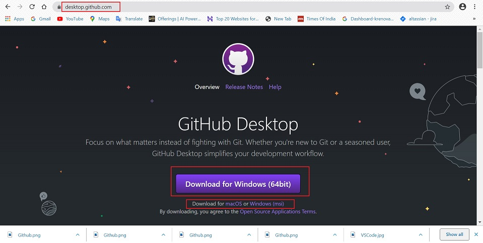

# **Desktop Github**

### **_Introduction_**

It's a fast, easy way to contribute to projects from OS X and Windows.
GitHub Desktop is designed to simplify essential steps in your GitHub workflow and replace GitHub for Mac and Windows with a unified experience across both platforms.
GitHub Desktop is an open-source Electron-based GitHub app.

Follow the below steps to Install and activate the desktop version:

1. Download Desktop GitHub:
   
    https://desktop.github.com/

    

2.  Step by step guide to set up and use Github Desktop can be reached at the below link:

    [GitHub Desktop Tutorial](https://help.github.com/en/desktop)    

    [Github Desktop Video Tutorial](https://www.youtube.com/watch?v=77W2JSL7-r8)

____
____

