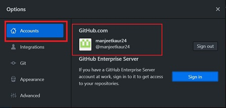

# **Desktop Github**

## **Introduction**

It's a fast, easy way to contribute to projects from OS X and Windows.

GitHub Desktop is designed to simplify essential steps in your GitHub workflow and replace GitHub for Mac and Windows with a unified experience across both platforms.

GitHub Desktop is an open-source Electron-based GitHub app.

## **Installing and Authenticaticating to Github Desktop**

Before you set up GitHub Desktop, you must already have a GitHub account.

### **Download & Install Desktop GitHub**

You can install GitHub Desktop on supported Microsoft Windows or macOS operating systems.
   
*   Go to: https://desktop.github.com/
*   Click "Download for Windows/Mac"

*   In your computer's **Downloads** folder, double-click **GitHub Desktop**.
*   In the pop-up window, click **Install**.
*   After the program has been installed, click **Run**.

####    :book: [Tutorial for Windows and Mac Users](https://docs.github.com/en/desktop/getting-started-with-github-desktop/installing-github-desktop#setting-up-github-desktop)

### **Setting up Desktop Github**

After you've launched GitHub Desktop, you can choose to set up GitHub Desktop right away.

-   You will be asked to sign into Github.

-   Once you sign in, you will need to approve permissions.

### **Authenticating to Github**

*   In the upper-left corner of the window, select the File menu.
*   Click Options

*   In Options -> Select Accounts

*   In the Accounts pane:

    *   To authenticate to GitHub, under "GitHub.com" click Sign In.
    *   Use the Github Username and password.

####    :book: [Authentication Tutorial](https://docs.github.com/en/desktop/getting-started-with-github-desktop/authenticating-to-github)

### **Configuring Basic Settings**

*   In the upper left corner:

    *   File -> Options
    *   Options -> Accounts: to add or remove a GitHub account
    *   Options -> Integrations: to pick an external editor or shell.

    

    *   Options -> Git: to edit your Git configuration.

    

    *   Options -> Appearance: to switch between the light or dark theme.

    

    *   Options -> Advanced: for more configuration options. 

    

####    :book: [Configuration Tutorial](https://docs.github.com/en/desktop/getting-started-with-github-desktop/configuring-and-customizing-github-desktop)

## **Cloning a Repository from Github to Github Desktop**

There are 2 ways to clone repositories:

### **Use GitHub to clone remote repositories to GitHub Desktop**

*   Sign in to Github and Github Desktop before you start to clone.
*   On Github, navigate to the main page of the repository.
*   Above the list of files, click "Code".

*   Click on "Open with Github Desktop"

*   Click "Choose", navigate to local path where you want to clone the repository.
*   Click on "Clone"

### **Cloning in Desktop Github**

-   Click on Current Repository tab
-   Click Add -> Clone Repository

-   A dialog box will appear with list of repositories you are part of.
-   Choose the repository you want to clone.

-   In Local Path: choose the location on your system where you want to clone the repository.
-   Click Clone

[Repository Cloning Help](https://docs.github.com/en/desktop/contributing-and-collaborating-using-github-desktop/adding-and-cloning-repositories)

## **Creating a Branch**

You can create a branch off of the repository's default branch so you can safely experiment with changes.

You **always** create a branch from an existing branch. Typically, you might create a branch from the **master** branch of your repository. You can then work on this new branch in isolation from changes that other people are making to the repository.

*   At the top of the app, choose your working repository, in the Current Repository tab.
*   Click on Current Branch tab.
*   Click on New Branch 

*   Add name of branch.
*   Click on Create branch.

[Branch Help](https://docs.github.com/en/desktop/contributing-and-collaborating-using-github-desktop/making-changes-in-a-branch)

### **Making Changes to Branch**

Using a text editor, such as [Visual Studio Code](Visual-Studio-Code.md), make the necessary changes to files in your project.

## **Committing changes to your project**

As you make changes to files in your text editor and save them locally, you will also see the changes in GitHub Desktop.

Similar to saving a file that's been edited, a commit records changes to one or more files in your branch. Git assigns each commit a unique ID, called a SHA or hash, that identifies:

-   The specific changes
-   When the changes were made
-   Who created the changes

*   **Select the branch** you have made changes to.
*   **Select changes** to include in a commit

    *   The red '-' icon indicates removed files.
    *   The yellow '.' icon indicates modified files.
    *   The green '+' icon indicates added files.
    *   To access stashed changes, click Stashed Changes.

*   **Write a Commit Message** : at the bottom of the list of changes, in the **Summary field**, type a short, meaningful commit message. Optionally, you can add more information about the change in the **Description field**.

*   Under the Description field, click **Commit to Branch**.

[Commit Help](https://docs.github.com/en/desktop/contributing-and-collaborating-using-github-desktop/committing-and-reviewing-changes-to-your-project)

## **Push Changes**

As you commit changes to your project locally, you can push those changes to GitHub so that others may access them from the remote repository.

When you push changes, you send the committed changes in your local repository to the remote repository on GitHub. If you change your project locally and want other people to have access to the changes, you must push the changes to GitHub.

*   **Click on Push origin** : to push your local changes to the remote repository.

*   **Click on Create Pull Request** : to open a pull request and collaborate on your changes. This will send email notification to the reviewer.

####    :book: [Push Changes Tutorial](https://docs.github.com/en/desktop/contributing-and-collaborating-using-github-desktop/pushing-changes-to-github)

## **Help & Guides**

*   [GitHub Desktop Tutorial](https://help.github.com/en/desktop)    

*   [Github Desktop Video Tutorial](https://www.youtube.com/watch?v=77W2JSL7-r8)

## **To do List**

To mark the training complete, finish the below tasks:

1.  Clone a test repository.
2.  Create a test branch.
3.  Commit changes made to the branch.
4.  Do a Pull request on the branch.

