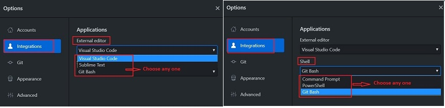

# **Desktop Github**

### **_Introduction_**

It's a fast, easy way to contribute to projects from OS X and Windows.

GitHub Desktop is designed to simplify essential steps in your GitHub workflow and replace GitHub for Mac and Windows with a unified experience across both platforms.

GitHub Desktop is an open-source Electron-based GitHub app.

### **_Installing and Authenticaticating to Github Desktop_**

Before you set up GitHub Desktop, you must already have a GitHub account.

#### **Download & Install Desktop GitHub**
   
*   Go to: https://desktop.github.com/
*   Choose Download to

*   Click and Run the installer file on your computer.

#### **Authenticating to Github**

*   In the upper-left corner of the window, select the File menu.
*   Click Options

*   In Options -> Select Accounts

*   In the Accounts pane:

    *   To authenticate to GitHub, under "GitHub.com" click Sign In.
    *   Use the Github Username and password.

#### **Configuring Basic Settings**

*   In the upper left corner:

    *   File -> Options
    *   Options -> Accounts: to add or remove a GitHub account
    *   Options -> Integrations: to pick an external editor or shell.

    

    *   Options -> Git: to edit your Git configuration.

    

    *   Options -> Appearance: to switch between the light or dark theme.

    

    *   Options -> Advanced: for more configuration options. 

    

### **_Cloning a Repository from Github to Github Desktop_**

You can use GitHub to clone remote repositories to GitHub Desktop.

*   Sign in to Github and Github Desktop before you start to clone.
*   On Github, navigate to the main page of the repository.
*   Above the list of files, click "Code".

*   Click on "Open with Github Desktop"

*   Click "Choose", navigate to local path where you want to clone the repository.
*   Click on "Clone"

### **_Creating a Branch_**

If you have collaborator permissions on a repository, you can create a branch off of the repository's default branch so you can safely experiment with changes.

*   At the top of the app, choose your working repository, in the Current Repository tab.
*   Click on Current Branch tab.
*   Click on New Branch 

*   Add name of branch.
*   Click on Create branch.

### **_Committing changes to your project_**

GitHub Desktop tracks all changes to all files as you edit them. You can decide how to group the changes to create meaningful commits.

*   Select the branch you have made changes to.
*   Select changes to include in a commit

    *   The red '-' icon indicates removed files.
    *   The yellow '.' icon indicates modified files.
    *   The green '+' icon indicates added files.
    *   To access stashed changes, click Stashed Changes.

*   At the bottom of the list of changes, in the Summary field, type a short, meaningful commit message. Optionally, you can add more information about the change in the Description field.
*   Under the Description field, click Commit to Branch.

*   Click on Push origin

*   Click on Create Pull Request: This will send email notification to the reviewer.

### **_Help & Guides_**

*   [GitHub Desktop Tutorial](https://help.github.com/en/desktop)    

*   [Github Desktop Video Tutorial](https://www.youtube.com/watch?v=77W2JSL7-r8)

____
____

