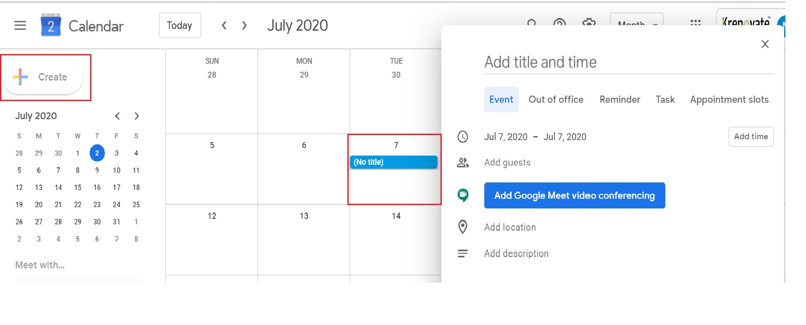

# **GSuite**

## **_Introduction_**

G Suite is a suite of cloud computing, productivity and collaboration tools, software and products developed by Google Cloud.

Here, at Krenovate, we use the G Suite - business version of Gmail for its varied features and apps availability, which supports the day-to-day functions easy and convenient.

G Suite provides access to a core set of apps that includes:

* Gmail
* Google Drive
* Google Calender
* Google Docs
* Google Sheets
* Google Slides
* Google Forms
* Google Meet
* Google Hangouts
* Google+
  
______
______

## **Gmail**

### **_Introduction_**

Gmail is a web-based email service, developed by Google. It has become popular for giving users large amounts of storage space, and for having threaded conversations and robust search capabilities.

As part of G Suite, Gmail comes with additional features designed for business use, including:

* Email addresses with the customer's domain name (@yourcompany.com)
* 99.9% guaranteed uptime with zero scheduled downtime for maintenance
* 30GB of storage space
* 24/7 phone and email support
* Synchronization compatibility with Microsoft Outlook and other email providers
* Support for add-ons that integrate third-party apps purchased from the G Suite Marketplace with Gmail

Gmail is the foremost App that is used for all official correspondence at Krenovate. 

Once the agreement is accepted by the freelancer, the official email id would be activated. 

### **_Account Creation_**

A new email account is created by the Admin. The link would be sent to your personal email id. 

### **_Account Activation_**

Once you click on the activation link, the email id would be activated.

After the activation, you will be asked to login with the credentials sent to you and reset your password.

### **_Account Verification_**

You will receive a verification link on the new email id. 
Clicking on the link, will verify your email id and will be ready to use.

Now, you are ready to receive official communication.

Happy Emailing !!

When you login to your business email with your credentials, you reach the below dashboard:

This dashboard gives access to all the apps used at Krenovate.

### **_FAQ's_**

For any query/help, refer to below links:

1. Popular Articles :  
   <https://support.google.com/mail/?hl=en#topic=7065107>

1. Manage your Gmail account :  
   <https://support.google.com/mail/?hl=en#topic=3394212>

1. Read & organize emails :  
   <https://support.google.com/mail/?hl=en#topic=3394150>

1. Settings :  
   <https://support.google.com/mail/?hl=en#topic=3394219>

1. Send emails :  
   <https://support.google.com/mail/?hl=en#topic=3394151>

1. Gmail App :  
   <https://support.google.com/mail/?hl=en#topic=2451730>

1. Use video calls in Gmail :  
   <https://support.google.com/mail/?hl=en#topic=9824892>

1. Fix a problem :  
   <https://support.google.com/mail/?hl=en#topic=3394215>
    
_____
_____

1.  Are Gmail addresses case sensitive?

    No, the complete Gmail address is case insensitive.

2.  Can I sort emails in Gmail?

    Unfortunately, Gmail doesn’t offer an official way to sort emails. However, there are alternative ways to sort Gmail by size, labels, subject, and sender.

3.  How to reset Gmail password?

    Sign in to Google account->Security Settings->Password->Change your password.

For more troubleshooting, follow the below link:

[Gmail Help Center](https://support.google.com/mail/?hl=en#topic=3394215)

____
____

## **Google Drive**

### **_Introduction_**

Google Drive is a file storage and synchronization service, described as "a place where you can create, share, collaborate, and keep all of your stuff".

Here, you can upload any type of file to the cloud, share them with others, and access them from any computer, tablet, or smartphone. 

You can sync files between any device and the cloud with apps for Microsoft Windows and Apple macOS computers, and Android and iOS smartphones and tablets.

### **_How to access Google Drive_**

Go to drive.google.com-> My Drive/ Follow the image below:

### **_Upload and store files_**

You can upload, view, share, and edit files with Google Drive. Type of files:

*   Documents
*   Images
*   Audio
*   Video

You can upload, drag & drop files in the Google Drive.

Convert documents into Google formats
If you want to upload files like Microsoft Word documents, you can change a setting to convert files.

*   From your computer, go to drive.google.com/drive/settings.
*   Next to "Convert Uploads," check the box.

### **_Share files_**

*   You can share the files and folders that you store in Google Drive with anyone in your work or school account.
*   When you share from Google Drive, you can control whether people can edit, comment on, or only view the file. 

[Google Drive Help Center](https://support.google.com/drive/answer/2424384?hl=en&ref_topic=14940)

### **_FAQ's_**

1.  Which browsers work with the web-based platform for Google Drive?

    For the best Google Drive experience with the most features, use the Google Chrome browser. Most other browsers will run the web-based version of Google Drive but with more limited functionality.

2.  How to resolve syncing issue in Google Drive?

    If some or all your files are not syncing between your computer and My Drive, try the below:

    *   Restart Backup and Sync
    *   Reinstall Backup and Sync
    *   Disconnect and reconnect your account
    *   Restart your computer

Find more help here :  [Syncing Issues Help](https://support.google.com/drive/answer/2565956?co=GENIE.Platform%3DDesktop&hl=en)

____
____

## **Google Calender**

## **Google Drive**

### **_Introduction_**

Google Drive is a file storage and synchronization service, described as "a place where you can create, share, collaborate, and keep all of your stuff".

Here, you can upload any type of file to the cloud, share them with others, and access them from any computer, tablet, or smartphone. 

You can sync files between any device and the cloud with apps for Microsoft Windows and Apple macOS computers, and Android and iOS smartphones and tablets.

### **_How to access Google Drive_**

Few ways to reach the Google Drive:

1.  Go to drive.google.com-> My-Drive

2.  Follow the image below:

### **_Upload and store files_**

You can upload, view, share, and edit files with Google Drive. Type of files:

*   Documents
*   Images
*   Audio
*   Video

You can upload, drag & drop files in the Google Drive.

Convert documents into Google formats
If you want to upload files like Microsoft Word documents, you can change a setting to convert files.

*   From your computer, go to drive.google.com/drive/settings.
*   Next to "Convert Uploads," check the box.

### **_Share files_**

You can share the files and folders that you store in Google Drive with anyone in your work.

Access to files can be given to:

*   Internal Employees
*   3rd party organisations/Non members

When you share from Google Drive, you can control whether people can edit, comment on, or only view the file. 

### **_FAQ's_**

Find the Step-by-step help on below links:

1.  Get started with Google Drive:

    https://support.google.com/drive/?hl=en#topic=14940

2.  Store files in Google Drive:

    https://support.google.com/drive/?hl=en#topic=7000756

3.  Organise and find your files:

    https://support.google.com/drive/?hl=en#topic=7000946

4.  Share files with Google Drive:

    https://support.google.com/drive/?hl=en#topic=7000947

5.  Sync files to your computer:

    https://support.google.com/drive/?hl=en#topic=6069785

6.  Docs, Sheets, Slides, and other apps:

    https://support.google.com/drive/?hl=en#topic=2799627

7.  Privacy, policies and offers:

    https://support.google.com/drive/?hl=en#topic=2375072

8.  Fix a problem:

    https://support.google.com/drive/?hl=en#topic=14951

_____
_____

## **Google Calender**

### **_Introduction_**

Google Calendar is an online calendar intended to help keep track of time and schedules. 
It integrates with Gmail for users to easily add events from email messages directly to the calendar.

Some additional features of G Suite Google Calender:

*   Smart scheduling of meetings - finds available times and locations, meeting rooms based on coworker's schedule.
*   Public calendars for consumers to see a business' upcoming events.
*   Calendar integration with Google Sites
*   Easy migration from Exchange, Outlook or iCal, or from .ics and .csv files.

### **_How to access Google Calender_**

Few ways to reach your calendar:

1.  Go to-> calender.google.com

2.  Access from the GSuite dashboard:

3.  Access from within Gmail:

### **_Creat Meeting & Invite people_**

*   Click on Create or an empty time on the calendar
*   Fill in all the options:

    *   Add title 
    *   Add time
    *   Add guests - email id
    *   Add location
    *   Add description
    *   Save

### **_Accept and Reject Meetings_**

*   Open the invitation email, or the event that was added to your calendar.
*   In the "Going?" section, click Yes, No, or Maybe.

### **_FAQ's_**

Know your Google Calendar better:

1.  Popular articles:

    https://support.google.com/calendar/?hl=en#topic=3417969

2.  Google Calendar App:

    https://support.google.com/calendar/?hl=en#topic=6076998

3.  Create/Invite/Delete Event:

    https://support.google.com/calendar/?hl=en#topic=3417926

4.  Share/Create/Edit Calendar:

    https://support.google.com/calendar/?hl=en#topic=3417921

5.  Import/Export/Sync:

    https://support.google.com/calendar/?hl=en#topic=3417927

6.  Calendar Settings:

    https://support.google.com/calendar/?hl=en#topic=3417971

7.  Troubleshooting:

    https://support.google.com/calendar/?hl=en#topic=3418057

_____
_____