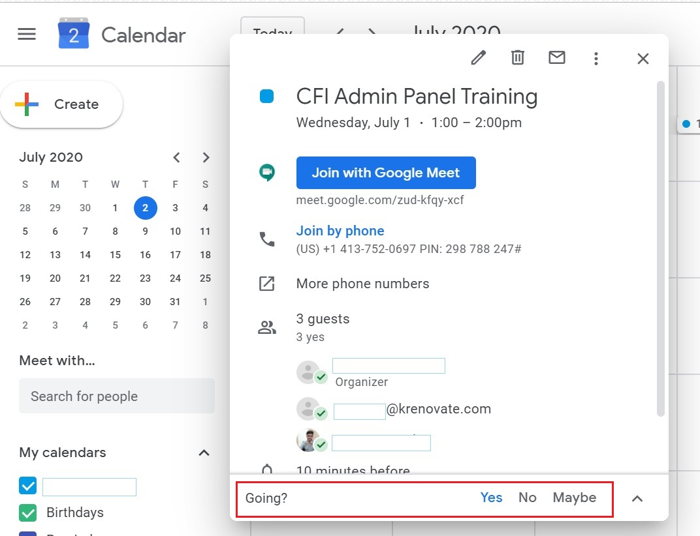
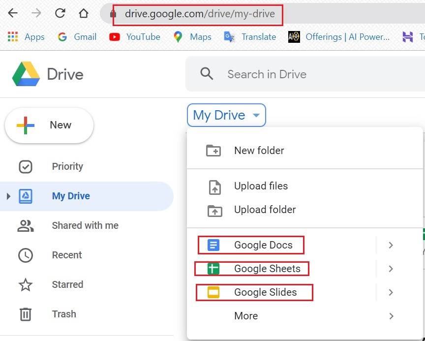
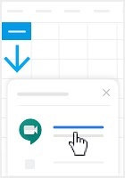

# **GSuite**

## **_Introduction_**

G Suite is a suite of cloud computing, productivity and collaboration tools, software and products developed by Google Cloud.

Here, at Krenovate, we use the G Suite - business version of Gmail for its varied features and apps availability, which supports the day-to-day functions easy and convenient.

G Suite provides access to a core set of apps that includes:

* Gmail
* Google Drive
* Google Calender
* Google Docs
* Google Sheets
* Google Slides
* Google Meet
* Google Hangouts
* Other Gsuite Apps
______
______

## **Gmail**

### **_Introduction_**

Gmail is a web-based email service, developed by Google. It has become popular for giving users large amounts of storage space, and for having threaded conversations and robust search capabilities.

As part of G Suite, Gmail comes with additional features designed for business use, including:

* Email addresses with the customer's domain name (@yourcompany.com)
* 99.9% guaranteed uptime with zero scheduled downtime for maintenance
* 30GB of storage space
* 24/7 phone and email support
* Synchronization compatibility with Microsoft Outlook and other email providers
* Support for add-ons that integrate third-party apps purchased from the G Suite Marketplace with Gmail

Gmail is the foremost App that is used for all official correspondence at Krenovate. 

Once the agreement is accepted by the freelancer, the official email id would be activated. 

### **_Account Creation_**

A new email account is created by the Admin. The link would be sent to your personal email id. 

### **_Account Activation_**

Once you click on the activation link, the email id would be activated.

After the activation, you will be asked to login with the credentials sent to you and reset your password.

### **_Account Verification_**

You will receive a verification link on the new email id. 
Clicking on the link, will verify your email id and will be ready to use.

Now, you are ready to receive official communication.

Happy Emailing !!

When you login to your business email with your credentials, you reach the below dashboard:

This dashboard gives access to all the apps used at Krenovate.

### **_FAQ's_**

For any query/help, refer to below links:

1. Popular Articles :  
   <https://support.google.com/mail/?hl=en#topic=7065107>

1. Manage your Gmail account :  
   <https://support.google.com/mail/?hl=en#topic=3394212>

1. Read & organize emails :  
   <https://support.google.com/mail/?hl=en#topic=3394150>

1. Settings :  
   <https://support.google.com/mail/?hl=en#topic=3394219>

1. Send emails :  
   <https://support.google.com/mail/?hl=en#topic=3394151>

1. Gmail App :  
   <https://support.google.com/mail/?hl=en#topic=2451730>

1. Use video calls in Gmail :  
   <https://support.google.com/mail/?hl=en#topic=9824892>

1. Fix a problem :  
   <https://support.google.com/mail/?hl=en#topic=3394215>

For more training videos and cheat sheet, visit the below link:
    
[Gmail Training & Help](https://support.google.com/a/users/answer/9259748?hl=en&ref_topic=9348670)
____
____

## **Google Drive**

### **_Introduction_**

Google Drive is a file storage and synchronization service, described as "a place where you can create, share, collaborate, and keep all of your stuff".

Here, you can upload any type of file to the cloud, share them with others, and access them from any computer, tablet, or smartphone. 

You can sync files between any device and the cloud with apps for Microsoft Windows and Apple macOS computers, and Android and iOS smartphones and tablets.

### **_How to access Google Drive_**

Few ways to reach the Google Drive:

*  From browser/computer:

   *  Go to drive.google.com-> My-Drive

*  From Gmail

### **_Upload and store files_**

You can upload, view, share, and edit files with Google Drive. Type of files:

*   Documents
*   Images
*   Audio
*   Video

You can upload, drag & drop files in the Google Drive.

Convert documents into Google formats
If you want to upload files like Microsoft Word documents, you can change a setting to convert files.

*   From your computer, go to drive.google.com/drive/settings.
*   Next to "Convert Uploads," check the box.

### **_Share files_**

You can share the files and folders that you store in Google Drive with anyone in your work.

Access to files can be given to:

*   Internal Employees
*   3rd party organisations/Non members

When you share from Google Drive, you can control whether people can edit, comment on, or only view the file. 

### **_FAQ's_**

Find the Step-by-step help on below links:

1.  Get started with Google Drive:

    https://support.google.com/drive/?hl=en#topic=14940

2.  Store files in Google Drive:

    https://support.google.com/drive/?hl=en#topic=7000756

3.  Organise and find your files:

    https://support.google.com/drive/?hl=en#topic=7000946

4.  Share files with Google Drive:

    https://support.google.com/drive/?hl=en#topic=7000947

5.  Sync files to your computer:

    https://support.google.com/drive/?hl=en#topic=6069785

6.  Docs, Sheets, Slides, and other apps:

    https://support.google.com/drive/?hl=en#topic=2799627

7.  Privacy, policies and offers:

    https://support.google.com/drive/?hl=en#topic=2375072

8.  Fix a problem:

    https://support.google.com/drive/?hl=en#topic=14951

For more training videos and cheat sheet, visit the below link:

[Google Drive Training & Help](https://support.google.com/a/users/answer/9282958?hl=en&ref_topic=9348670)
_____
_____

## **Google Calender**

### **_Introduction_**

Google Calendar is an online calendar intended to help keep track of time and schedules. 
It integrates with Gmail for users to easily add events from email messages directly to the calendar.

Some additional features of G Suite Google Calender:

*   Smart scheduling of meetings - finds available times and locations, meeting rooms based on coworker's schedule.
*   Public calendars for consumers to see a business' upcoming events.
*   Calendar integration with Google Sites
*   Easy migration from Exchange, Outlook or iCal, or from .ics and .csv files.

### **_How to access Google Calender_**

Few ways to reach your calendar:

From browser/computer:

*   Go to-> calender.google.com

From GSuite Dashboard:

From Gmail

### **_Creat Meeting & Invite people_**

*   Go to Google Calendar
*   Click on Create or an empty time on the calendar
*   Fill in all the options:

    *   Add title 
    *   Add time
    *   Add guests - email id
    *   Add location
    *   Add description
    *   Save

### **_Accept and Reject Meetings_**

*   Open the invitation email, or the event that was added to your calendar.
*   In the "Going?" section, click Yes, No, or Maybe.

### **_FAQ's_**

Know your Google Calendar better:

1.  Popular articles:

    https://support.google.com/calendar/?hl=en#topic=3417969

2.  Google Calendar App:

    https://support.google.com/calendar/?hl=en#topic=6076998

3.  Create/Invite/Delete Event:

    https://support.google.com/calendar/?hl=en#topic=3417926

4.  Share/Create/Edit Calendar:

    https://support.google.com/calendar/?hl=en#topic=3417921

5.  Import/Export/Sync:

    https://support.google.com/calendar/?hl=en#topic=3417927

6.  Calendar Settings:

    https://support.google.com/calendar/?hl=en#topic=3417971

7.  Troubleshooting:

    https://support.google.com/calendar/?hl=en#topic=3418057

For more training videos and cheat sheet, visit the below link:

[Google Calendar Training & Help](https://support.google.com/a/users/answer/9247501?hl=en&ref_topic=9348670)

_____
_____

## **Google Docs/Sheets/Slides/Forms**

### **_Introduction_**

Google Docs, Google Sheets and Google Slides are respectively a word processor, a spreadsheet and a presentation program, which are integrated into Google Drive. They all serve as collaborative software that:

*   Allows users to view & edit documents, spreadsheets and presentations in real time through a web browser or mobile device.
*   Changes are saved automatically, maintaining a revision history to track changes.
*   Provides capability to give various permissions - view, comment, edit, download.

### **_How to access Google Docs/Sheets/Slides_**

Few ways to reach your editors:

From browser/computer:

*   Go to-> drive.google.com

From GSuite Dashboard:

From Gmail:

### **_Creating Sheets_**

1.  Go to Google Docs/Sheets/Slides
2.  Click on Start new document/spreadsheet/presentation
3.  Your work gets saved automatically.

### **_Sharing Sheets_**

1.  Go to Google Docs/Sheets/Slides
2.  Click on the file you want to share
3.  Click on Share

### **_FAQ's_**

For help on Google Docs/Sheets/Slides, click on the relevant links.

1.  Google Docs:

    https://support.google.com/docs/topic/9046002?hl=en&ref_topic=1382883

    [Google Docs Training & Help](https://support.google.com/a/users/answer/9282664?hl=en&ref_topic=9348670)

2.  Google Sheets:

    https://support.google.com/docs/topic/9054603?hl=en&ref_topic=1382883

    [Google Sheets Training & Help](https://support.google.com/a/users/answer/9282959?hl=en&ref_topic=9348670)

3.  Google Slides:

    https://support.google.com/docs/topic/9052835?hl=en&ref_topic=1382883

    [Google Slides Training & Help](https://support.google.com/a/users/answer/9282488?hl=en&ref_topic=9348670)

4.  Google Forms: 

    https://support.google.com/docs/topic/9055404?hl=en&ref_topic=1382883    

    [Google Forms Training & Help](https://support.google.com/a/users/answer/9282666?hl=en&ref_topic=9348670)

5.  Use with Google Drive & other Google Apps:

    https://support.google.com/docs/?hl=en#topic=9110468

6.  Use Google Docs/Sheets/Slides at work:

    https://support.google.com/docs/?hl=en#topic=9111076

7.  Privacy policies:

    https://support.google.com/docs/?hl=en#topic=1360897

8.  Accessibility:

    https://support.google.com/docs/?hl=en#topic=6039805

_____
_____

## **Google Meet**

### **_Introduction_**

Google Meet is a video-communication service developed by Google. It is one of two apps that constitute the new version of Google Hangouts, the other being Google Chat.

Meet works with all modern browsers, and there’s no plugin required when using your desktop or laptop.

At Krenovate, we use Google Meet:

*  to share video, desktop, and presentations with teammates and customers.

*  for scheduled and instant video meetings or to join a video call. 

### **_Start/Schedule Meeting_**

 From Gmail:

*   In the sidebar, click *Start a Meeting*.

*   Click Join now for a video meeting, or click Join and use a phone for audio for an audio-only meeting.

From Calendar:

*   Click *Create +*
*   Add your event details and guests.
*   Click Add rooms, location, or conferencing. 
*   Click Save.

## **_Join Meeting_**

From Gmail:

*   In the sidebar, click Join a meeting and enter a meeting code.

From Calendar:

*   Click the event, then click Join with Google Meet.

From Meet:

*   Join a scheduled meeting or use a meeting code.

From mobile devices:

*   Open the Android or Apple® iOS® Meet app.

### **_FAQ's_**

1.  Introduction to Google Meet:

    https://support.google.com/meet/?hl=en#topic=7306097

2.  Start and Join video meetings:

    https://support.google.com/meet/?hl=en#topic=7192926

3.  During the meeting:

    https://support.google.com/meet/?hl=en#topic=7290350

4.  Use Meet with other products:

    https://support.google.com/meet/?hl=en#topic=9225666

5.  Settings:

    https://support.google.com/meet/?hl=en#topic=7294099

6.  Troubleshooting:

    https://support.google.com/meet/?hl=en#topic=7290455

For more training videos and cheat sheet, visit the below link:

[Google Meet Trainings & Help](https://support.google.com/a/users/answer/9282720?hl=en&ref_topic=9348670)

____
____

## **Google Hangouts**

### **_Introduction_**

Google Hangouts is the chat app built into the free version of Gmail, and it also offers video chat.

Hangouts syncs automatically across devices. If you start a Hangout on your computer, you can continue your chat on another device, like your phone.

 You can use Hangouts to:

*   Start a chat conversation.
*   Make phone calls using wi-fi or data.
*   Send text messages with your Google Voice.

### **_How to access Hangouts_**

From Gmail:

*   In the sidebar, click *Chat*.
*   Add contacts and start messaging.

From GSuite Dashboard:

*   Go to gsuite.google.com
*   Click on Google Hangouts

From Browser:

*   Go to hangouts.google.com.
*   Enter your Google Account information.
*   Click Sign in.

### **_Sending and accepting invites_**

*   Go to Hangouts
*   Click on New Conversation
*   Enter and select a name or email address
*   Click Video call for video call, or start typing for a chat

### **_Hangouts Group Chats_**

Hangouts group chat offers the privilege of conversing with many people at the same time. It gives easy access for sharing vital information, brainstorming and giving brief overviews of subject matters.

Few benefits of Hangout Group chats are:

*   You can send useful files and documents to many individuals at the same time.
*   It gives options to edit messages, send messages in bold and italic formats.
*   It can be used as a conference room by a team working together.
*   You can start and join a video call also.

### **_FAQ's_**

1.  Get started with Hangouts:

    https://support.google.com/hangouts/?hl=en#topic=6386410

2.  Use and manage Hangouts:

    https://support.google.com/hangouts/?hl=en#topic=6386417

3.  Hangouts Chrome extension & app:

    https://support.google.com/hangouts/?hl=en#topic=6386427

4.  Troubleshoot Hangouts:

    https://support.google.com/hangouts/?hl=en#topic=6386432

    For more training videos and cheat sheet, visit the below link:

    [Google Hangouts Trainings & Help](https://support.google.com/a/users/answer/9282720?hl=en)

_____
_____

### **_Other GSuite Apps_**

Many more apps avaiblable at Google Marketplace. Follow the link:

[Google Marketplace](https://www.google.com/enterprise/marketplace)

____
____

