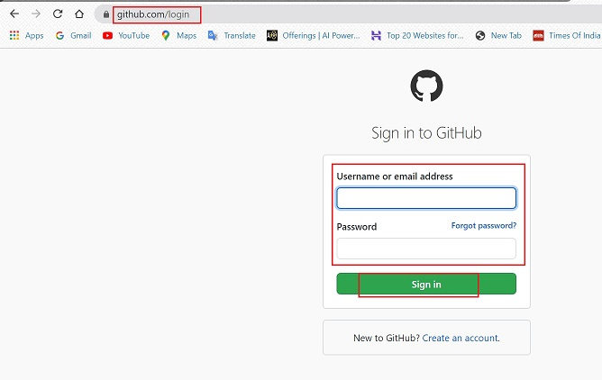

# **Github**

### **_Introduction_**

GitHub brings teams together to work through problems, move ideas forward, and learn from each other along the way.

GitHub is a Git repository hosting service, but it adds many of its own features. While Git is a command line tool, GitHub provides a Web-based graphical interface. It also provides access control and several collaboration features, such as a wikis and basic task management tools for every project.

GitHub is a code hosting platform for version control and collaboration. It lets you and others work together on projects from anywhere. Version controlling your document allows you to:

1.  Track developments and changes in your documents.
2.  Record the changes you made to your document in a way that you will be able to understand later.
3.  Experiment with different versions of a document while maintaining the original version.
4.  ‘Merge’ two versions of a document and manage conflicts between versions.
5.  Revert changes, moving ‘backwards’ through your history to previous versions of your document.

### **_Account Creation_**

Follow the below steps:

*    Go to -> www.github.com
*    Sign up with company email

### **_Account Verification_**

*    Verify your email to complete signup

### **_Github Login_**

*    Go to: github.com
*    Click on Sign In
*    Login with your credentials

### **_Courses to do_**

*    Once you login, choose the below training. It will be added to your repository, which can be accessed to learn the basics of GitHub at any time.
*    Both these trainings will give basic knowledge about Github and Markdown.

1.    https://lab.github.com/githubtraining/introduction-to-github
2.    https://lab.github.com/githubtraining/communicating-using-markdown

   

### **_Key Terms about Github_**

*    **_Repository_**

     *    A repository is usually used to organize a single project.
     *    It can contain folders, files, images, spreadsheets- anything a project needs.
     *    Inside your account, all Repositories you are part of show on the left side panel of the home page.

     

*    **_Branch_**

     *    Branching is the way to work on different versions of a repository at one time.
     *    By default your repository has one branch named "master" which is considered to be the definitive branch. 
     *    Every team member can clone the master branch to their own working branch.

*    **_Commit_**

     *    On GitHub, saved changes are called commits.
     *    Each commit has an associated commit message, which is a description explaining why a particular change was made.
     *    Commit messages capture the history of your changes, so other contributors can understand what you’ve done and why.

*    **_Pull Request_**

     *    Pull Requests are the heart of collaboration on GitHub.
     *    When you open a pull request, you’re proposing your changes and requesting that someone review and pull in your contribution and merge them into their branch.
     *    Pull requests show diffs, or differences, of the content from both branches.
     *    The changes, additions, and subtractions are shown in green and red.

*    **_Merge Pull Request_**

     *    In this final step, it’s time to bring your changes together – merging your edited branches into the master branch.

### **_Github Flow_**

Following is the GitHub flow:

*    Create a branch from the repository.
*    Create, edit, rename, move, or delete files.
*    Send a pull request from your branch with your proposed changes to kick off a discussion.
*    Make changes on your branch as needed. Your pull request will update automatically.
*    Merge the pull request once the branch is ready to be merged.

### **_Collaboration with Github Desktop_**

For all the basic purpose we use the [Github Desktop](Desktop-Github.md) version, which lets you run all the basic commands for day to day work.

### **_Help & Guides_**

*    https://docs.github.com/en/github/getting-started-with-github
*    https://guides.github.com/activities/hello-world/
*    https://try.github.io/
*    https://www.youtube.com/watch?v=iv8rSLsi1xo
*    https://lab.github.com/

