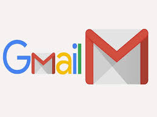
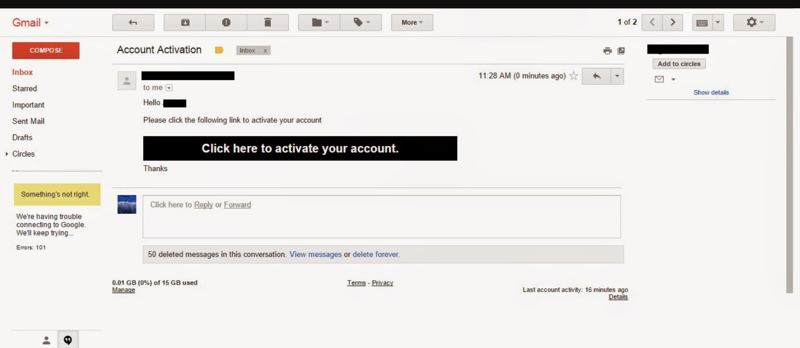
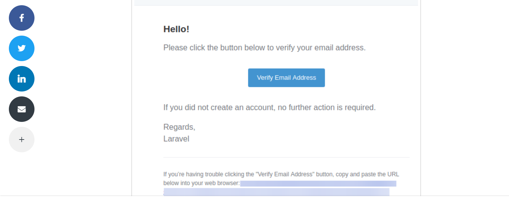

# **Gmail**

## **Introduction**

Gmail is a free email service developed by Google. Users can access Gmail on the web and using third-party programs that synchronize email content through POP or IMAP protocols.

Gmail is the foremost App that is used for all official correspondence. 

Once the agreement is accepted by the freelancer, the official email id would be activated. 

### **_Account Creation_**
A link would be sent to your personal email id. 
Once you click on the activation link, the email id would be activated.

### **_Account Verification_**

You will receive a verification link on the new email id. 
Clicking on the link, will verify your email id and will be ready to use.

Now, you are ready to receive official communication.

Happy Emailing !!

