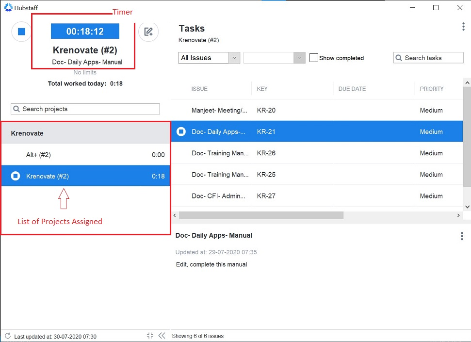

# **Hubstaff Desktop Client - Hubstaff Recorder**

## **Introduction**

Hubstaff's Desktop Client/app is an easy way to keep track of time worked. It helps you record your time spent on various activities.

## **App Download**

Follow the below steps to Install and activate the app:

*   Download the app from https://hubstaff.com/download

*   It is compatible with various Operating Systems:

## **Install & Sign in**

Install and sign in to the client with the Hubstaff user id and password.

## **Time Tracking**

### **How the timer works**

The Hubstaff Recorder App has two parts:

-  **_Left Side Panel_**

    When you start the client and login, you’ll see:

   *   Timer on top
   *   List of assigned projects. 
   *   Select the project you want to work on.

    

-   **_Right Side Panel_**

    Once you have selected the project:

    -   You will see a list of tasks in the selected project.
    -   Start timer for the issue you have to work on.

    

    **Note:** Task timer should ALWAYS be started on the right side.

### **How the activity is recorded**  

All the time recorded in the app is automatically visible on the Hubstaff Web page.

Check your “Activity” page on Hubstaff Web for screenshots, time and activity percentages.

## **Important Tips**

Few things to keep in mind:

-   When you start the Hubstaff Recorder, all your assigned tasks will be visible there.
-   Time is recorded task wise; click only on the task you have to work on.
-   This app is to track your task wise time; in case of more activities on the task, login to your Jira account.
-   You can start/stop the timer any time when you want.

## **Help & Guides**

For more information on Hubstaff, follow the link below:

*   [Quick Start Guide](https://support.hubstaff.com/quick-start-guide-for-new-users/)

*   [Downloading the Desktop App](https://support.hubstaff.com/downloading-the-desktop-client/)

*   [Install & Sign in](https://support.hubstaff.com/install-and-sign-in-into-windows-desktop-client/)

*   [Desktop App Walkthrough](https://support.hubstaff.com/desktop-apps-walkthrough/)

*   [Watch Video](https://www.youtube.com/watch?v=O6nT3zdIVHY)

## **To Do List**

When you complete the above training, do the below task to mark your training complete.

1.  Share a screen shot of the assigned task which shows on the Recorder.

    -   Open the Hubstaff Recorder
    -   Take print screen by using one of the below methods:

        -   shift+windowskey+S
        -   ctrl+prtsc key
        -   shift+command+3 (only for mac users)

2.  Try to record time for the assigned task by starting the timer for that particular task.

