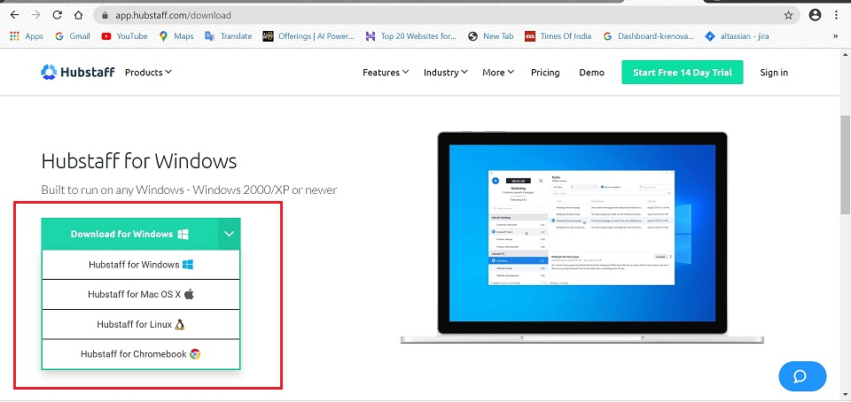

## **Hubstaff Desktop Client - Hubstaff Recorder**

### **_Introduction_**

Hubstaff's Desktop Client/app is an easy way to keep track of time worked. It helps you record your time spent on various activities.

### **_App Installation_**

Follow the below steps to Install and activate the app:

1.  Download the app from https://hubstaff.com/download

2.  It is compatible with various Operating Systems:

### **_Install_**
Install and sign in to the client with the Hubstaff user id and password.

### **_Time Tracking_**

* When you start the client and login, you’ll be presented with a number of projects for you to select.

* You should always select the project that you are currently working on as these projects will be reflected in your reports in the Hubstaff web interface.

* Check your “Activity” page on Hubstaff Web for screenshots, time and activity percentages.

For more information on Hubstaff, follow the link below:
https://support.hubstaff.com/quick-start-guide-for-new-users/

____
____
