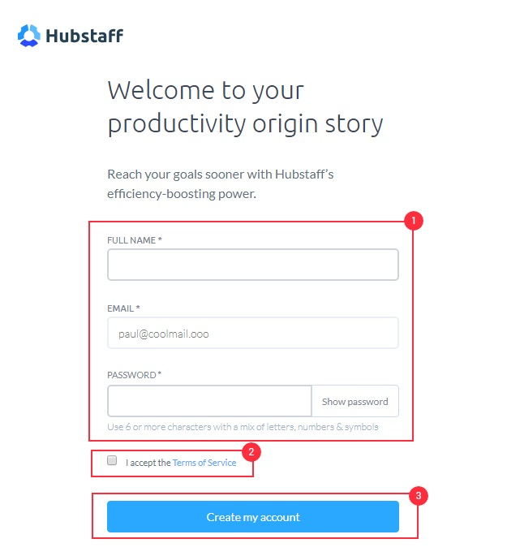

## **Hubstaff Web**

### **_Introduction_**
Hubstaff is a simple application that helps to track time, activity levels, and take screenshots. You can select a project, and Hubstaff will then track time and activity to that specific project, which becomes viewable in the web application.

### **_Account Creation_**

*   You will receive an email from your the HR that will invite you to join Hubstaff.

*   Accept the invitation by clicking on the Accept Invite tab.

*   Once you click on that link, then you’ll be sent to the Hubstaff Sign Up page.

This is the page that will create your account in Hubstaff:

*   As you follow the above steps and click on Create my account, you shall see an option to select the organization:

*   Click Go to join the organization which you have been invited to by your Employer.

After confirming your account, You are all set and you can login here:

 https://hubstaff.com/login

_____
_____
