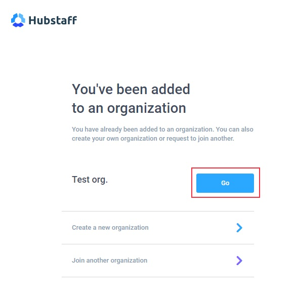
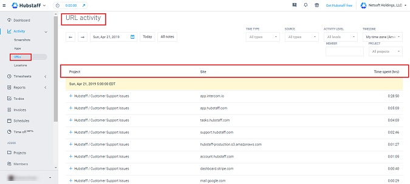
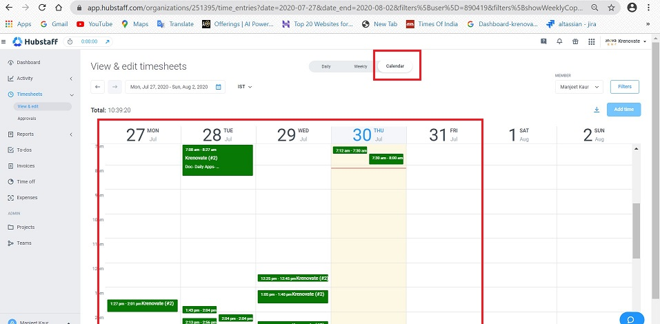

# **Hubstaff Web**

### **_Introduction_**

Hubstaff is an employee time tracking software with screenshots, reporting, and automated payments.

To track time, your virtual workforce installs the tracking applications on your machines to track time, activity levels, and take screenshots. The app can also record locations (mobile), applications being used and websites you have visited.

 You can select a project, and Hubstaff will then track time and activity to that specific project, which becomes viewable in the web application.

### **_Account Creation_**

*   You will receive an email invitation from your the HR join Hubstaff.

*   Accept the invitation by clicking on the Accept Invite tab.

*   Once you click on that link, then you’ll be directed to the Hubstaff Sign Up page.

This is the page that will create your account in Hubstaff:

*   As you follow the above steps and click on Create my account, you shall see an option to select the organization:

*   Click Go to join the organization which you have been invited to by your Employer.

### **_Logging In_**

* Go to https://hubstaff.com/login
* Sign in with your company email id

### **_Things to know about Hubstaff Web_**

Hubstaff’s Web Application provides a central location to access data regarding your/ teams’ tracking and performance.

Let's discuss the options available and their use.

####   **Dashboard**

  * The Dashboard is the home screen of your Hubstaff Web App. 
*   It provides an overview of your activity and the main statistics across the total hours tracked and total amount spent.
*   The Recent Activity widget displays screenshot of activities where time has been tracked most recently.

    

####   **Activity**

The Activity section displays data tracked by the users, broken down into a detailed daily format.

  *   *Screenshots*

        *   The images are uploaded from the users’ tracking client and displayed in this section.
        *   Each row of screenshots represents one hour of time tracked by a user. 
        *  The timestamp of when the screenshots were taken is displayed above each row of images as well as the total time tracked within that hour.
        *  Multiple images representing each 10-minute interval are then displayed within each hourly row

        

  *  *Apps*

        *   Using Hubstaff, it is possible to monitor what apps are being used by the user during their work time.
        *   In this section, you will find activity data regarding 
            *   the name of the app used
            *   on which date it was accessed
            *   how many times it was accessed
            *   how long it was accessed for 
            *   under which project the user was tracking time against.

        

  *   *URLs*

        *   With Hubstaff, a user's URL browing history can be monitored.
        *   The website accessed by the user is captured and presented under this section.
        *   In this section, you will find activity data regarding 
            *   the URL/Website accessed
            *   on which date it was accessed
            *   how long it was accessed for 
            *   under which project the user was tracking time against.

        

####   **Timesheets**     

Under the Timesheets section, data regarding the time tracked by the users in a daily, weekly or calendar format can be found. 

  *   *View & Edit*

        The time can be tracked in various ways:

        *   Daily : 
  
            *   Daily Timesheets provides the daily time tracked by the users
            *   It displays the exact time the user started and stopped their timer
            *   the daily total number of hours tracked 
            *   which projects you were tracking time against

        

        *   Weekly :

            *   The Weekly Timesheet section provides the weekly time tracked by the user.
            *   It displays the total number of hours. tracked per day, as well as per weekly time span.
            *   It also shows a breakdown of how much time was spent per project.
            *   And, the total number of weekly hours worked.

        

         *   Calendar :

                *   The Calendar section displays the individual user’s timesheets in a calendar view.
  
        

In all type of timesheets, it is possible to filter the data by user, source (how time was tracked), timezone, and date by clicking the relevant menu at the top of the screen.

####   **Reports**   

*   Hubstaff has an extensive reporting section in which detailed monitoring data can be reviewed regarding your performance.
*   This option is more useful for the Team Managers in order to track and measure team performance at an organization level.
*   There are various levels at which tracking can be done.

### **_Help & Guides_**

For more ellaborate help visit the below links:

*   https://support.hubstaff.com/web-application-dashboard-overview-owners/#todos
*   https://www.youtube.com/watch?v=L5wx34FJjls
  

