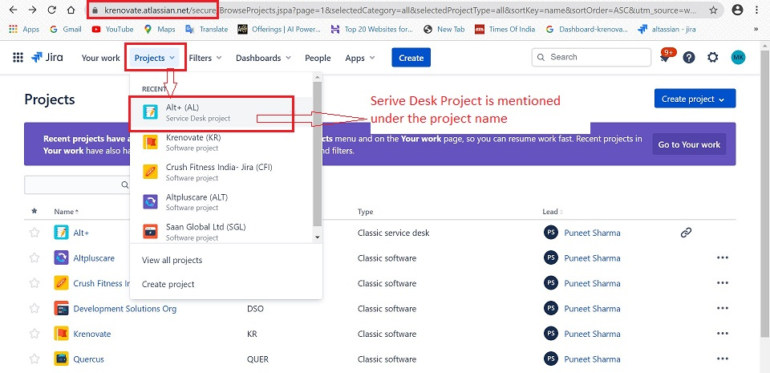

# **Jira Service Desk**

## **Introduction**

Jira Service Desk is simply modern service desk software. It brings more structure to your work, gives you increased visibility into what your team is up to, and helps your team members get more done, so you can deliver better service. It is used primarily:

*   By teams who receive incoming issues/requests from other teams/customers.
*   Is designed specifically for end-users to submit tickets to a help desk team.

## **Why use Jira Service Desk**

Jira Service Desk integrates directly with Jira and brings you all the power and productivity of Jira to your service desk teams in the below ways:

*   An intuitive, customer-centered interface - It lets you craft easy-to-use forms for your users:
    *   Create clean and simple customer portals with clear calls to action.
    * Build templates for users to enter all the details you need.
    * Display contextual information, re-map statuses, and hide fields your users don’t need.

*   A powerful service level agreement (SLA) engine - Jira Service Desk manages your service level agreement (SLA) commitments out of the box:
    *   Set up advanced SLA metrics with complex start, pause, and stop criteria.
    * Ensure your IT teams keep priorities front of mind with clear countdown and color codes for every request
    * Let Jira automatically apply relevant targets on each new request with its powerful rules engine.

*   Customizable team queues - Manual triage and prioritization of requests is a thing of the past:
    * Set up queues of requests automatically shared across all IT team members
    * Improve the visibility and alignment of your IT teams with live updating queues
    * Use the power of JQL to customize the ordering of the requests within a queue

*   Real-time reports and analytics - *"That which gets measured, gets improved"*.  With Jira Service Desk, you can assess performance and improve your IT team’s efficiency:
    * Get insights out of the box with key volume and time-based reports.
    * Assess progress and identify bottlenecks in real time
    * Apply SLA metrics retroactively to your current Jira data to observe trends

## **The difference between Jira and Jira Service Desk**

*   *Jira*, is for internal teams to work together on issues/projects, whereas, *Jira Service Desk*. lets the end users submit tickets which can be tracked by the service desk team.
*   *Jira*, can be very technical for people who don't use it everyday, whereas, *Jira Service Desk* is quick, and easy due to it's simple interface.

## **User types and Roles**

Primarily there are two licensed roles: administrators and agents. The administrator sets up and configures service desk projects. The agent works in these projects.

In this manual, we will focus on the agent/user role.

### **Agents**

The Service Desk Team Members who work on customer requests are termed as "Agents". An agent can:

*   View the customer portal, queues, reports and SLA metrics for a project
*   Add, edit, and delete customer-facing and internal comments on issues
*   Add customers to a project
*   Read knowledge base content

## **How a Service Desk works**

Here's how your customers and service desk agents work together to resolve a request:

*   The customer raises a request through the portal provided.
*   The request is added to the project service desk queue.
*   Initially, it is assigned to the Project Manager, who decides who will work and resolve the ticket.

## **Accessing Service Desk Projects**

Follow the steps below to access the Service desk project you are part of :

1.  Login to your Jira account.
2.  Go to -> Projects.
3.  Choose the Service Desk Project.

## **Jira Service Desk Features/Sidebar**

Once you have reached your service desk project, you’ll find the **sidebar**, which has helpful features which you may want to use. Know your sidebar better, as below:

*   Queues

Queues are where you view issue that customers have submitted to your service desk.

-   Customers

Here you can view your customers and their requests, and invite new customers to service desk.

*   Reports

The reports section gives you a view about your team's SLA goals, knowledge base and workload.

-   Raise a Request

Here you as a service desk user, can raise service requests on behalf of a customer.

-   Knowledge Base

You can get a little creative with your knowledge here. You can creat articles which can help team members. Also, you can search for articles in your team's knowledge base.

*   Customer Channels

This gives you a view of your service desk's portal (where you can find the ways customers send you requests) and email address.

-   Invite Team

From this option, you can invite an existing service desk agent/user to work on your project.

## **Assignment of Ticket**

Below is the flow of how the ticket is assigned to you:

-   Customer raises ticket
-   Ticket comes to the project queue
-   Ticket is automatically assigned to the Project Manager (PM)
-   PM decides which agent will work on the ticket
-   The ticket is assigned to the agent/user
-   The user receives a e-mail notification

## **View Issue/Ticket**

There are 2 ways to view issues assigned to you:

**From Email**

-   Click on "View Issue" on the email.

**From Browser**

-   Login to your Jira account
-   Go to -> Projects
-   Choose the Service Desk Project
-   Go to -> Queues
-   Choose issue
-   Click on "Summary" on the issue

## **Navigate your Workspace**

Once, you are on your Service Desk Project, you will get a view of your Queues Page.

The options under the Queue section are explained below:

-   **T** : is the type of issue (Bug etc.)
-   **Key** : is the issue#
-   **Summary** : gives basic idea about what the issue is related to.
-   **Reporter** : is your Customer who has raised the issue.
-   **Assignee** : is the agent/user who will resolve the ticket
-   **Status** : this is the status of the ticket (open, close, in progress, resolved)
-   **Created** : is the date when the issue/ticket was raised by the customer.

### **Understanding Customer Issues/Tickets**

#### **Description**

Click an issue's Summary or Key to view more information about an issue, or start working on an issue. The issue view looks like this: 

From here, you can work with customers and your team to resolve requests.

#### **See everyone involved in the Issue/Ticket**

The right side panel of the issue view shows everyone involved in the issue. Here are the people you might see:

-   **Assignee** : The person tasked with resolving the issue.
-   **Reporter** : The customer who sent the request.
-   **Request participants and Organizations** : Customers and groups of customers who can view and comment on the issue. They might be included if they’re interested in the outcome of the issue.
-   **Approvers** : If the issue has approvers, this field displays people who are tasked with approving or declining the request.

### **Comment/Communicate on an Issue**

You can communicate with your internal team as well as the customer who made the request, from the issue view. 

All types of communicatication is recorded under the "Activity" section of the issue view.

#### **Comments for Customer**

To respond to the Customer, follow below steps:

1.  Go to -> Activity
2.  Click -> Comments
3.  Select -> Reply to Customer
4.  Type your Comment
5.  Click "Save"

This is how the comment will show in activity once saved.

**Note** : The background color for customer comments is always white.

#### **Comments for Internal Team**

To add an internal note, follow below steps:

1.  Go to -> Activity
2.  Click -> Comments
3.  Select -> Add Internal Note
4.  Type your Comment
5.  Click "Save"

This is how the comment will show in activity once saved.

**Note** : The background color for internal note is always pink.

### **Closing an Issue/Ticket**

When you have finished helping your customer, you can close the issue/ticket to mark it as complete.

**To close a request:**

1.  From your service desk project, Go to -> Queues
2.  Select the request you want to resolve.
3.  Select the **Status** and Click **Mark as Done** 
4.  A new window to choose your resolution response will open.

5.  Add relevant comments for Customer and internal note.
6.  Click on "Mark as Done" to save.

## **Help & Guides**

[User Guide](https://support.atlassian.com/jira-service-desk-cloud)

[Getting Started](https://confluence.atlassian.com/servicedeskserver/getting-started-for-service-desk-agents-939926229.html)

