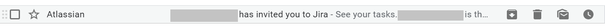
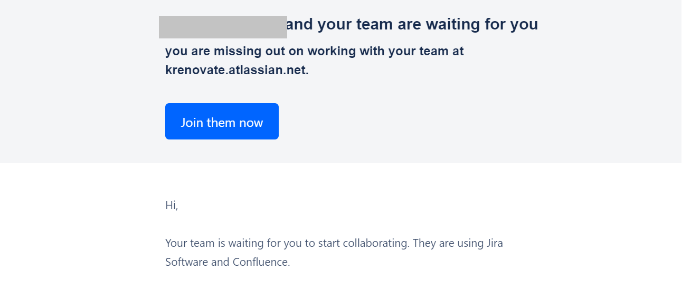

### **Jira**

JIRA is a tool developed by Australian Company Atlassian. It is used for bug tracking, issue tracking, and project management. 
The basic use of this tool is to plan, track, and release software.

#### *Account Creation*

Your account on Jira will be created by the HR department. And you will get a link for logging into your account on your official email ID. 

Create your login credentials and remember the same for unnecessary hassle. 
Once you create your account, please contact your manager to assign you to relevant projects.

#### *Logging In*

To log in, please visit - krenovate.atlassian.net and click on the sign in button. Please use your credentials to log in. 

For free tutorial visit:

https://www.atlassian.com/software/jira/guides

#### *Projects*

After logging in, you will see your dashboard. And on your dashboard, you will see the projects of which you are a part. If you do not see any projects on your dashboard, please contact your manager immediately or the HR.

Projects are various active sets of activities, being accomplished by a specific group of people. You can be a part of a single or multiple projects. In every project, only people relevant to that project are present. If you become a part of a project that you are not supposed to be, please inform the HR to remove you from that project. If you fail to inform the HR, and later on it is realised that you continued to be a part of a particular project, of which you were not supposed to, the company can take disciplinary action against you.

_____
____

