# **Jira**

## **Introduction**

JIRA is a tool developed by Australian Company Atlassian. It is used for bug tracking, issue tracking, and project management. 
The basic use of this tool is to plan, track, and release software.

At Krenovate, Jira is the most important used app due to it's project management and task tracking tools.

This manual is focussed on the Users/team members. It has been designed keeping in mind the steps to be taken by the Team members.

## **Account Creation**

Your account on Jira will be created by the HR department. And you will get a link for logging into your account on your official email ID. 

Create your login credentials and remember the same for unnecessary hassle. 
Once you create your account, please contact your manager to assign you to relevant projects.

## **Logging In**

To log in, please visit - krenovate.atlassian.net and click on the sign in button. Please use your credentials to log in. 

For free tutorial visit:

https://www.atlassian.com/software/jira/guides

## **Key terms to know**

*   **_Tasks_**

       * A Jira 'task' refers to a single work item of any type or size that is tracked from creation to completion. 
       * A task represents work that needs to be done.
       * A task has a more technical nature.
       * A task can be referred as "issue".

    Few examples of tasks could be:

    *   a feature being developed by a software team
    *   a to-do item for a marketing team
    *   a contract that needs to be written by the legal team

*   **_Sub-Tasks_**

    *   Subtask issues are useful for splitting up a parent issue into a number of smaller tasks that can be assigned and tracked separately.
    *   It addresses issues more comprehensively and segregates the task into smaller chunks of task to do.
    *   A sub-task has to be totally related to the parent task.

*   **_Projects_**

    A project is, quite simply, a collection of Tasks, that are held in common by purpose or context. Teams can use a Jira project to:

    *   Coordinate the development of a product
    *   Track a project
    *   Manage a help desk

    Jira Software projects are flexible working spaces that allow you to group like tasks by team, business unit, product, or stream of work. 
    
    Projects don't need to be tied to the same delivery date. 

*   **_Workflows_**

    Workflows represent the sequential path a task takes from creation to completion. A basic workflow might look something like this:

    

    In this case, Open, Done, and the labels in between represent the status a task can take, while the arrows represent potential transitions from one status to another. 

*   **_Epics_**

    *   An Epic is a large body of work that can be broken down into a number of smaller tasks.
    *   Epics group together bugs, stories, and tasks to show the progress of a larger initiative.
    *   An Epic can run across multiple versions.

*   **_Stories_**

    *   Also called “user stories,” are short requirements or requests written from the perspective of an end user.
    *   At Krenovate, we do not use stories.

*   **_Versions_**

    *   Versions are points-in-time for a project.
    *   Versions can be termed as "Phases of launch" of a project.
    *   They help you schedule and organize your releases.
    *   You can assign tasks in your project to a specific version, and organise your sprints around completing work in that version.
    *   Versions that include end dates can indicate when a release is overdue.

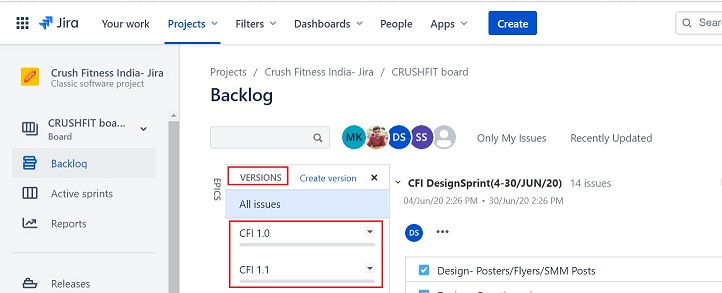

*   **_Backlog_**

    *   It is simply a list of tasks that represents outstanding work in a project assigned to you.
    *   The Backlog gives you place to organize your sprints.
    *   You can create new issues or sub-tasks, organize your backlog, create versions, organize via epics, and start sprints.

*   **_Sprints_**

    *   It can be termed as a "Timeline of tasks".
    *   A sprint is a short, time-boxed period when a team works to complete a set amount of work. 
    *   A sprint is a fixed time period where teams complete work from their product backlog.
    *   Sprints are usually one, two, or four weeks long.

*   **_Active Sprints_**

    *   An Active Sprint of a Scrum board displays the issues that your team is currently working on.
    *   You can create and update tasks/issues, drage and drop issues to transition them through a workflow.

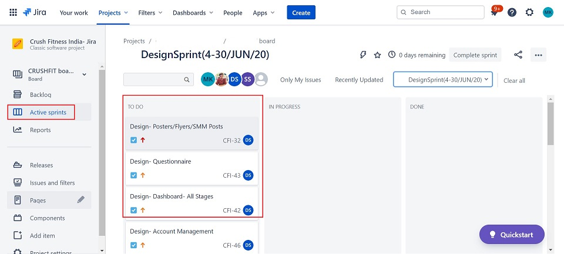

*   **_Components_**

    *   Components represent stakeholders of a project.
    *   Component Stakeholders are different group of people who are goig work on and use projects.
    *   Component is a generic term which can be used effectively to represent an module of an project.

[Watch the tutorial to understand the key terms](https://www.youtube.com/watch?v=tVS5YbHBjQw)

## **Task Allocation and Management**

Tasks in Jira are allocated by your Manager. Below are a few tasks which are to be handled ONLY by managers:

-   Create a Project
-   Assign issues to Users
-   Manage Users/Team members
-   Track time for users

As a user, the most important thing to understand is the tasks allocated to you and how to manage them.

In this section, we will discusss about tasks allocated to you in detail.

Once, your Jira account is activated, your manager will assign tasks to you.

### **_How to view your task_**

There are different ways to view your tasks:

**Email:**

-   You will receive an email intimation for task assigned. 

*   Click on "View Issue" -  You will be taken to the task description page in Jira.

**Browser:**

-   Login to your Jira account
-   Go to -> Projects
-   Choose the project assigned to you.

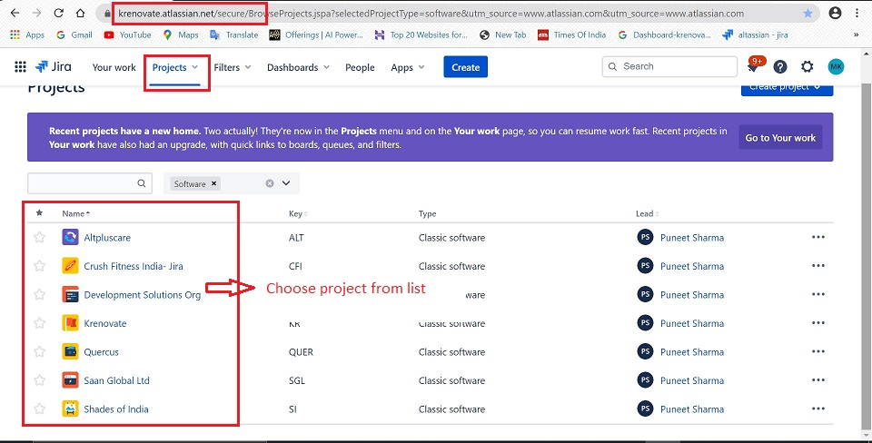

-   Go to -> Backlog
-   You will see list of tasks assigned to you

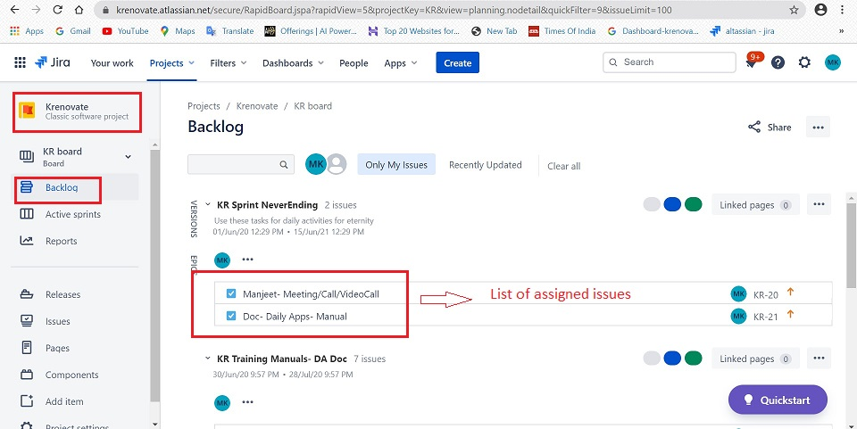

-   Click on the issue to be worked on

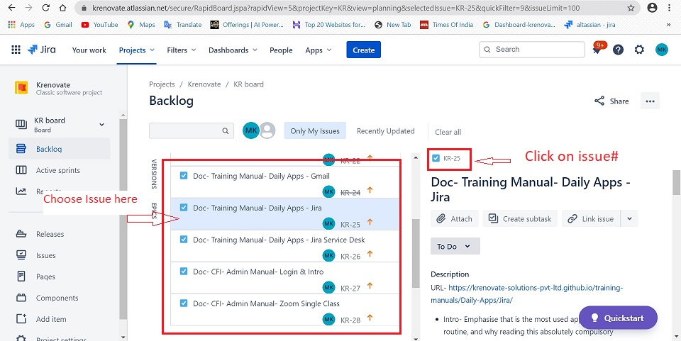

### **_Description of Task_**

Task description will tell you all about the work to be done under that task.

#### **_Top Panel_**

The top panel of the description page shows options as below:

-   **Name of the issue:** It shows the name of the issue.

    

-   **Attach:** You can attach relevant files, images from the attachment tab below the task name.

    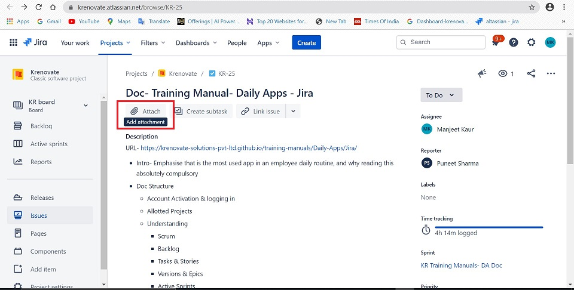

-   **Create Sub-task:**

    *   Within the assigned task, you can add sub-tasks to organise your work.
    *   Click on Create Subtask

    

    *   Enter the description of the sub-task and click on create.

    

#### **_Right Side Panel_**

On the right side of the screen various options are available which are described below:

-   **Status of the task:**

    *   When task is assigned it shows "To Do"
    *   Task should never be marked as "In Progress"

    

-   **Assignee:** It is the name of the user to whom  the task is assigned to.

    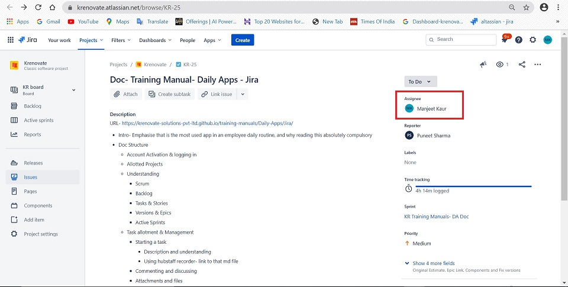

-   **Reporter:**  This shows your manager name

    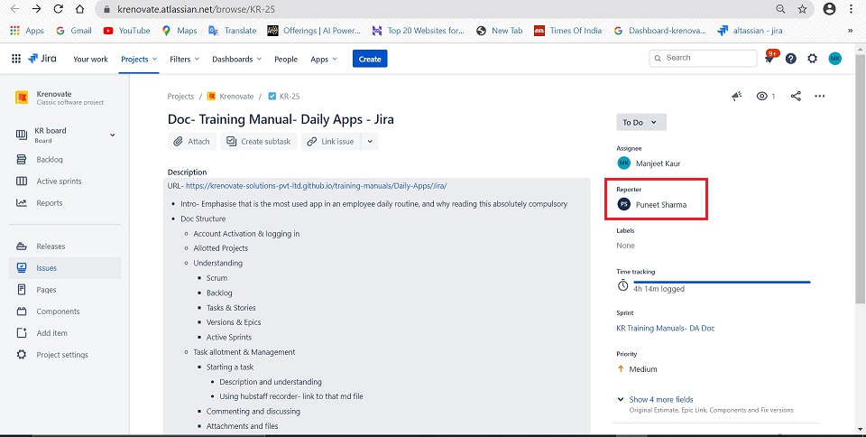

-   **Time Tracking:** This shows the duration of time spent in performing the task.

    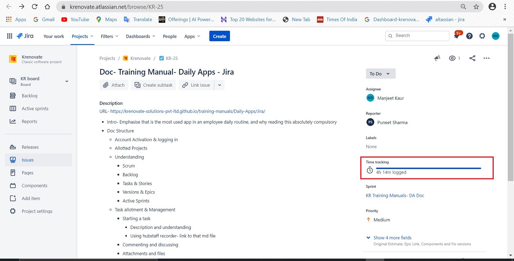

Note: Time is tracked using the [Hubstaff Recorder App](Hubstaff-Recorder-App.md)

  
-   **Sprint:** Shows the name of the active sprint of which the task is a part.

    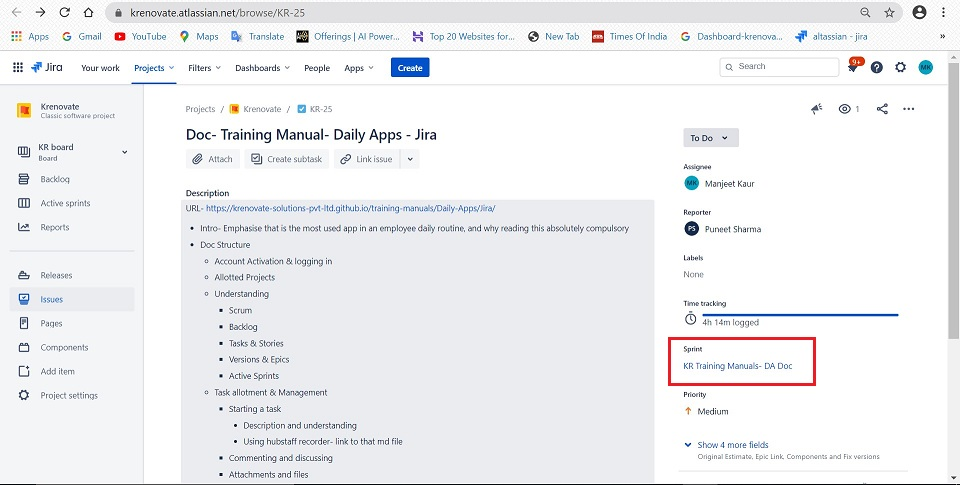

-   **Priority:** Here the priority can be set as low, medium, high depending on the project requirement.

    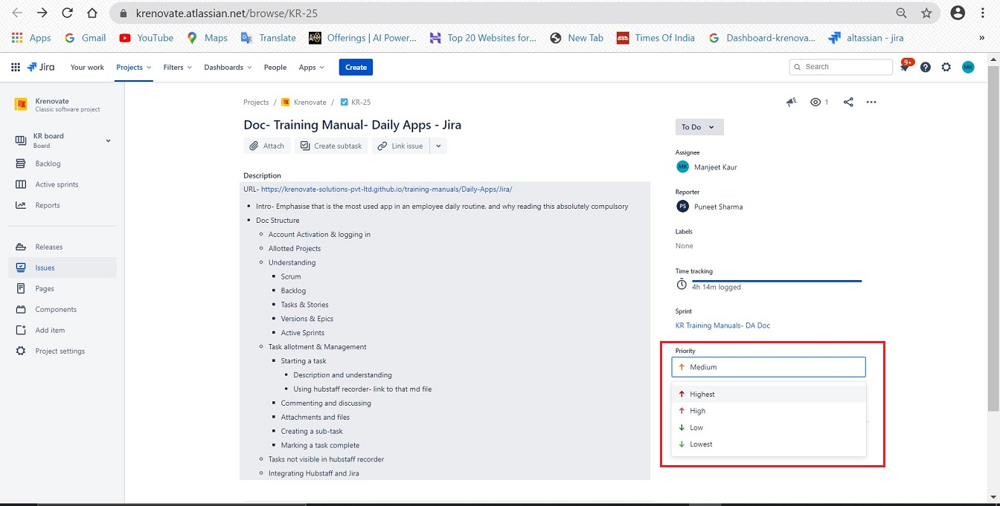

#### **_Bottom Panel_**

The Bottom panel shows details of various activities occuring in the issue.

-   **Comments:**  While you're working on an issue, you will probably need to share some information, clarify some
requirements, or discuss some details about the issue with your team. This is easy to do with issue comments:

    *   You can comment, attach files, send links through the comment section of the task.
    *   To email other users about your comment, simply mention these users in the Comment text box (by typing @User's Name). An email will be sent to the users' email addresses that are registered with their JIRA accounts.
    *   All formatting options are available within.
    *   Click on Save

    

    *   Once you add a comment, a mail notification is received by the tagged person.

    

-   **History:** The history tab gives a detailed view of all the activity that takes place while performing the task.

-   **Work Log:** The work log tab shows the time spent of doing the task.

### **_Marking Task Complete_**

 *  After your work has been reviewed and approved, the last step is to close or resolve the
issue.
*   Select "Done" in the task status option.

## **Tutorials and User Guides**

Follow the below useful links for more information:

*   https://www.softwaretestinghelp.com/atlassian-jira-tutorial-1/
*   https://www.guru99.com/jira-tutorial-a-complete-guide-for-beginners.html#1
*   https://www.atlassian.com/software/jira/guides
*   https://www.tutorialspoint.com/jira/jira_tutorial.pdf

## **To Do List**

Once you finish the training, follow the below task list. Finishing these tasks would mark your Jira training complete.

1.  Ask your manager to assign a task for you.
2.  Add a comment to the task
3.  Attach some test files and share with manager
4.  Mark the task complete.

