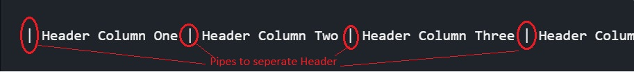
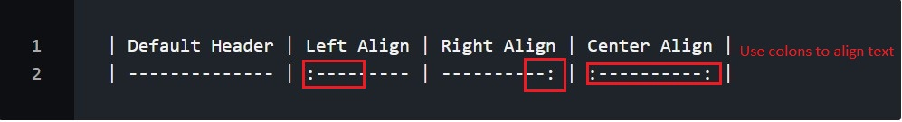
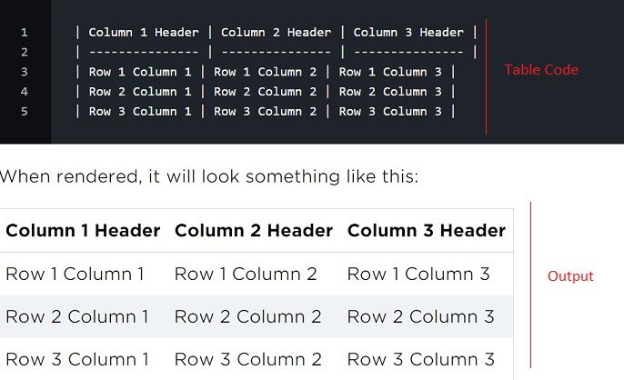
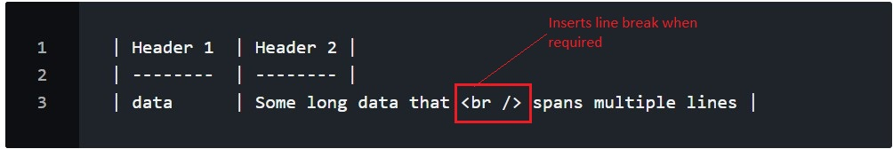

# **Markdown**

## **Introduction**

Markdown is a way to write content for the web. It’s written in what people like to call “plaintext”, which is exactly the sort of text you’re used to writing and seeing. Plaintext is just the regular alphabet, with a few familiar symbols, like asterisks ( * ) and backticks ( ` ).

It is now one of the world’s most popular markup languages.

Markdown is a fast and easy way to take notes, create content for a website, and produce print-ready documents.

### **Why Use Markdown?**

You might be wondering why people use Markdown instead of using a simpler editor. Why write with Markdown when you can press buttons in an interface to format your text? As it turns out, there are a couple different reasons for this:

*   Markdown can be used for *everything* -  to create websites, documents, notes, books, presentations, email messages, and technical documentation.
*   Markdown is *portable*. Files containing Markdown-formatted text can be opened using virtually any application. 
*   Markdown is *platform independent*. You can create Markdown-formatted text on any device running any operating system.
*   Markdown is *future proof*. Even if the application you’re using stops working at some point in the future, you’ll still be able to read your Markdown-formatted text using a text editing application. This is considered important in cases of books, theses, documents.
*   Markdown is *everywhere*. Websites like Reddit and [GitHub](GitHub.md) support Markdown, and lots of desktop and web-based applications support it.

## **Writing in Markdown**

Markdown uses basic syntax to format the content. 

### **Formatting text**

Formatting text in Markdown has a very gentle learning curve. It doesn’t do anything fancy like change the font size, color, or type. All you have control over is the display of the text—stuff like making things bold, creating headers, and organizing lists.

Few commonly used syntax are as below:

|Element|Markdown Syntax|
|:-------|---------------:|
|Heading|# H1 ## H2 ### H3|
|Bold|** text ** __ text __|
|Italic|* text * _ text _|
|Blockquote|> text|
|Ordered List|1. Item 1 2. Item 2 3. Item 3|
|Unordered List|- Item 1/ * Item 1 - Item 2/ * Item 2 - Item 3/ * Item 3|
|Link|[title](link to be inserted)|
|Image||

### **Creating Table in Markdown**

1.  **Add Header** : To specify the headers, simply separate each header with spaces and pipes. Make sure to include a pipe at the beginning and end of the line as well.

    

2.  **Alignment of text** : Each column can be aligned left, right, or center. The alignment is set by using a pattern of dashes and a colon separated by spaces and pipes.

    -   To left-align a column, put a colon to the left of two dashes :--.
    -   Three dashes --- can also be used.
    -   To right-align, put a colon to the right of two dashes --:.
    -   To center-align, surround a dash with two colons :-:.

    

3.  **The body** of the table consists of any number of rows separated by line breaks. Like the header, every cell is separated by a pipe character "|". 

    

4.  Insert **"< br >"** when you need to force a line break in a specific place in your content.

    

  
####    [Markdown Cheat Sheet- All Syntax](https://www.markdownguide.org/cheat-sheet/)

####    [Emoji Cheat Sheet- Complete list](https://gist.github.com/rxaviers/7360908) :smiley:

## **Getting Started**

The best way to get started with Markdown is to use it. 

The only thing you need to start is a markdown editor like [Visual Studio Code](Visual-Studio-Code.md) and you are ready.

Follow the steps in the below video:

:computer: [Markdown for Beginners using Visual Studio Code](https://www.youtube.com/watch?v=UvaZzOkM1j0)

## **Help & Guides**

*   https://www.markdownguide.org/

*   https://www.youtube.com/watch?v=HUBNt18RFbo

## **To Do List**

Your Markdown training will be considered complete when you finish the below tasks:

1.  Create a test Markdown file.
2.  Add text using all the formatting syntax.

