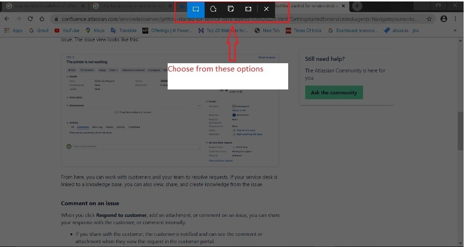
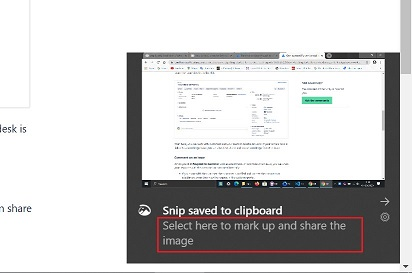
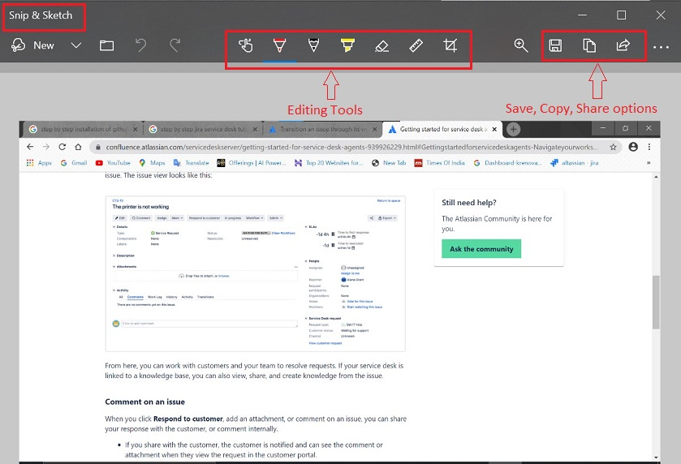
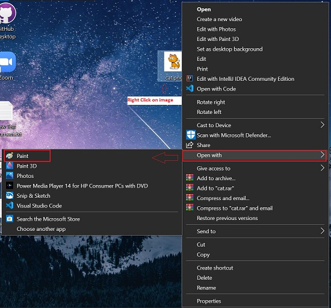
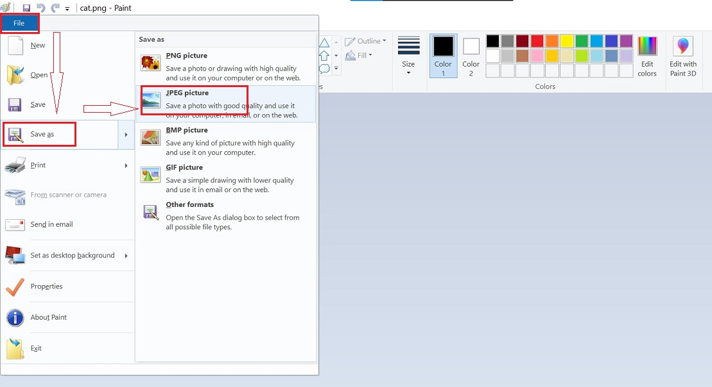

# **Tips and Tricks**

This document contains some tips and tricks for some basic day to day tasks we do

## **How to take a Print Screen/Screen Shot**

### **For Windows Users**

**Method 1**

1.  Open the screen for which you need screen shot.
2.  Press and hold "ctrl, prt scrn" keys together on your keyboard (this will copy the required screen).
3.  Open new file in "Paint".
4.  Click on Paste or ctrl+V.
5.  Format the picture in paint as per requirement.
6.  Save the file.

**Method 2**

1.  Open the screen for which you need screen shot.
2.  Press and hold "shift, windows key, S" keys together on your keyboard.
3.  Choose the relevant option for snipping. You can choose to snip only part of the screen, full screen, random part.

    

4.  You will see a dialog box "Snip saved to Clipboard".
5.  Click on "Select here to mark up and share the image".

    

6.  You will reach the "Snip & Sketch" screen.
7.  Use the editing tools to make the  required changes to the picture.
8.  Save/Share/Copy the file.

    

### **For Mac Users**

1.  Open the screen for which you need screen shot.
2.  Press and hold these three keys together: "Shift, Command, and 3". 
3.  If you see a thumbnail in the corner of your screen, click it to edit the screenshot. Or wait for the screenshot to save to your desktop.

[For more options, Click here](https://support.apple.com/en-in/HT201361)

**Note** : By default, screenshots save to your desktop with the name ”Screen Shot [date] at [time].png.”

## **How to convert any image file to JPEG format**

1.  Go to the image.
2.  Right Click on it.
3.  Select -> Open with Paint

    

4.  Image will open in Paint App.
5.  Go to -> File -> Save As -> Jpeg

    

6.  Save the image with .jpeg extension.