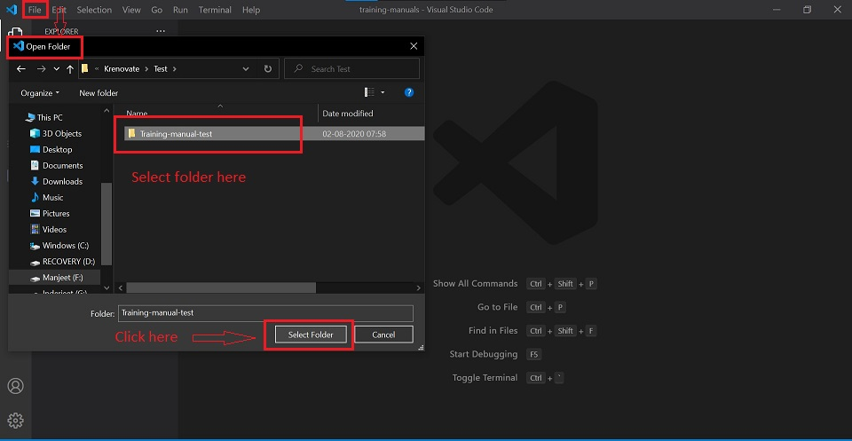
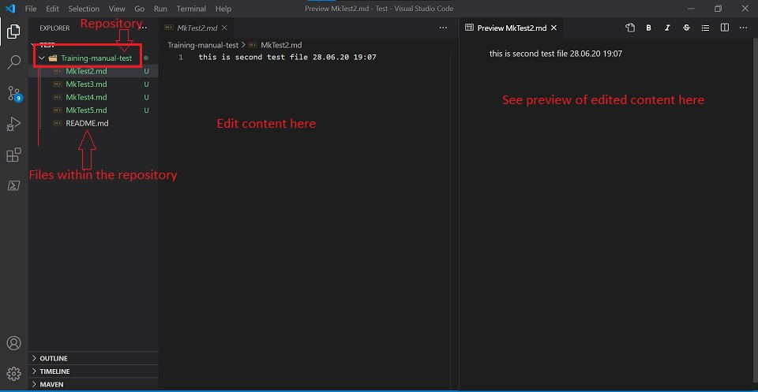
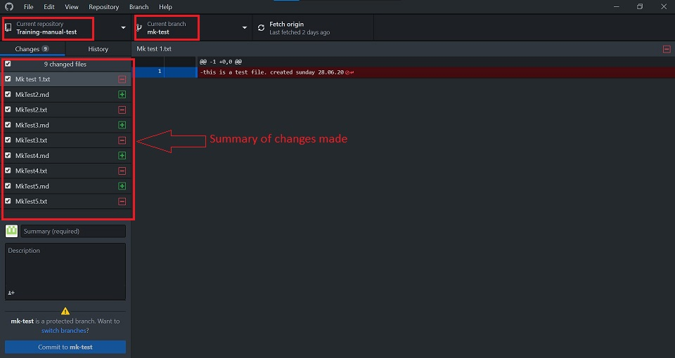

# **Visual Studio Code**

## **Introduction**

" Edit, build, and debug with ease"

Visual Studio Code is a free source-code editor made by Microsoft for Windows, Linux and macOS. 

Features include support for:
*   debugging 
*   syntax highlighting
*   intelligent code completion 
*   snippets
*   code refactoring
*   embedded Git
*   multiple languages eg: python, C/C++, javascript, markdown etc.

## **Setup**

Getting up and running with Visual Studio Code is quick and easy. It is a small download so you can install in a matter of minutes and give VS Code a try.

For reference purpose, we will use example of Windows here.

### **Installation**

Follow the below steps to download and install Visual Studio Code editor:

1.  Download the Visual Studio Editor installer from: https://code.visualstudio.com/

    

2.  Once it is downloaded, run the installer (VSCodeUserSetup-{version}.exe). This will only take a minute.

####    :book: [Download Visual Studio Code Tutorial - All Operating Systems](https://code.visualstudio.com/download) 

### **Get Started**

Getting set up on VS Code is a simple process. Watch the [video](https://code.visualstudio.com/docs/introvideos/basics) to learn about the setup and basics of Visual Studio Code.

## **Using Basic Features in VS Code**

Start your journey using Visual Studio Code with this set of introductory videos and articles! These videos are designed to give you an overview of VS Code's various features and quickly get you familiar with them.

These videos use JavaScript, but feel free to use any language you are comfortable with!

### **Customize**

Personalise VS Code to suit your needs through changing settings, themes, keybindings.

####    :book: [Customization Tutorial](https://code.visualstudio.com/docs/introvideos/configure)

### **Extensions**

*   Add features, themes and more to VS Code with extensions.
*   VS Code extensions let you add languages, debuggers, and tools to your installation to support your development workflow.

#### **Browse for Extensions**

1.  Click on the Extensions icon in the Activity bar.

2.  Search for the required language extension.

#### **Install an Extension**

1.  Click on the extension.
2.  Click on Install

####    :book: [Extensions Tutorial](https://code.visualstudio.com/docs/introvideos/extend)

### **Basic Editing: Keyboard Shortcuts**

Being able to keep your hands on the keyboard when writing code is crucial for high productivity. VS Code has a rich set of default keyboard shortcuts as well as allowing you to customize them.

####    [Cheatsheet for Shortcuts](https://code.visualstudio.com/shortcuts/keyboard-shortcuts-windows.pdf)

## **Working with Github in VS Code**

Using GitHub with Visual Studio Code lets you share your source code and collaborate with others. GitHub integration is provided through the GitHub Pull Requests and Issues extension.

We use the [Desktop Github](Desktop-Github.md) to integrate the code with Github.

## **Markdown and Visual Studio Code**

At Krenovate, we use "Markdown" as the source code language. 

Markdown files have an extension as ".md".

Working with Markdown files in Visual Studio Code is simple, straightforward, and fun. Besides VS Code's basic editing, there are a number of Markdown specific features that will help you be more productive.

Learn more about [Markdown](Markdown.md) here.

## **How to Edit files in Visual Code Editor**

When you are ready to work in the Visual Studio Code, follow the below steps:

1.  Go to -> File -> Open Folder
2.  Select the "folder/repository" on your local machine you want to work on.

    

3.  Start adding/editing content as per requirement. You can add multiple folders and .md files to your repository.

    

4.  Make changes to the [mkdocs.yml file](mkdocs-yml.md). This is a very important step. Without updating the .yml file, the content of your documentation will not show properly on the website.

All the changes that you make in the repository, will show up in the [Desktop Github](Desktop-Github.md) window.

To update your content on the website, follow the steps in the [Desktop Github](Desktop-Github.md).

## **Help & Guides**

*   [Visual Studio Code user guide](https://code.visualstudio.com/docs/introvideos/basics)

*   [Video Guide](https://www.youtube.com/watch?v=VqCgcpAypFQ)

