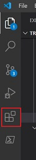

# **Visual Studio Code**

## **_Introduction_**

" Edit, build, and debug with ease"

Visual Studio Code is a free source-code editor made by Microsoft for Windows, Linux and macOS. 

Features include support for:
*   debugging 
*   syntax highlighting
*   intelligent code completion 
*   snippets
*   code refactoring
*   embedded Git
*   multiple languages eg: python, C/C++, javascript, markdown etc.

## **_Setup_**

Getting up and running with Visual Studio Code is quick and easy. It is a small download so you can install in a matter of minutes and give VS Code a try.

For reference purpose, we will use example of Windows here.

### **Installation**

1.  Download Visual Studio Editor from: https://code.visualstudio.com/

2.  Once it is downloaded, run the installer (VSCodeUserSetup-{version}.exe). This will only take a minute.

See the [Download Visual Studio Code](https://code.visualstudio.com/download) page for a complete list of available installation options.

### **Get Started**

Watch the small video to learn about the setup and basics of Visual Studio Code.

https://code.visualstudio.com/docs/introvideos/basics

## **_Using Basic Features in VS Code_**

Start your journey using Visual Studio Code with this set of introductory videos and articles! These videos are designed to give you an overview of VS Code's various features and quickly get you familiar with them.

These videos use JavaScript, but feel free to use any language you are comfortable with!

### **Customize**

Personalise VS Code to suit your needs through changing settings, themes, keybindings.

https://code.visualstudio.com/docs/introvideos/configure

### **Extensions**

*   Add features, themes and more to VS Code with extensions.
*   VS Code extensions let you add languages, debuggers, and tools to your installation to support your development workflow.

https://code.visualstudio.com/docs/introvideos/extend

#### **Browse for Extensions**

1.  Click on the Extensions icon in the Activity bar.

2.  Search for the required language extension.

#### **Install an Extension**

1.  Click on the extension.
2.  Click on Install

### **Basic Editing: Keyboard Shortcuts**

Being able to keep your hands on the keyboard when writing code is crucial for high productivity. VS Code has a rich set of default keyboard shortcuts as well as allowing you to customize them.

[Cheatsheet for Shortcuts](https://code.visualstudio.com/shortcuts/keyboard-shortcuts-windows.pdf)

## **_Working with Github in VS Code_**

Using GitHub with Visual Studio Code lets you share your source code and collaborate with others. GitHub integration is provided through the GitHub Pull Requests and Issues extension.

We use the [Desktop Github](Desktop-Github.md) to integrate the code with Github.

## **_Markdown and Visual Studio Code_**

At Krenovate, we use "Markdown" as the source code language. 

Markdown files have an extension as ".md".

Working with Markdown files in Visual Studio Code is simple, straightforward, and fun. Besides VS Code's basic editing, there are a number of Markdown specific features that will help you be more productive.

Learn more about [Markdown](Markdown.md) here.

 ## **_Help & Guides_**

*   [Visual Studio Code user guide](https://code.visualstudio.com/docs/introvideos/basics)

*   [Watch Video](https://www.youtube.com/watch?v=VqCgcpAypFQ)

