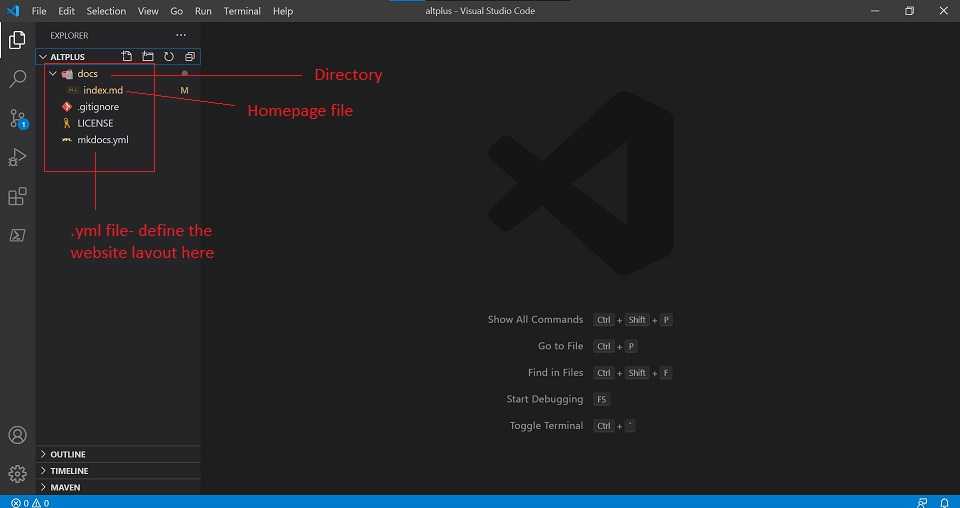
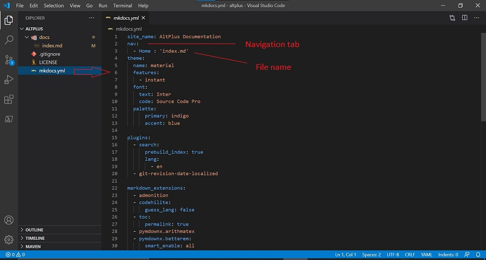
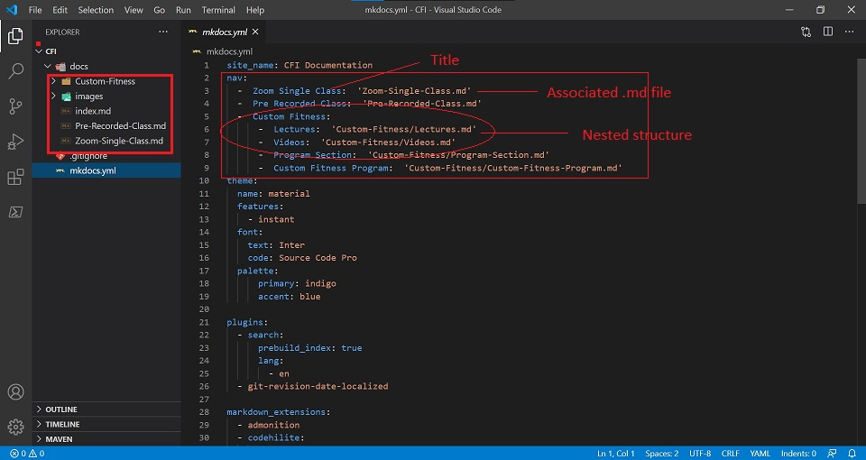

# **MkDocs YML**

## **Introduction**

MkDocs is a fast and simple static **site generator** designed for building project documentation.

Documentation source files are written in **Markdown**, and configured with a single YML configuration file.

**Host anywhere**

MkDocs builds completely static HTML sites that you can host on **_GitHub pages_**, Amazon S3, or anywhere else you choose.

**Great themes available**

There's a stack of good looking themes available for MkDocs. Choose between the built in themes: mkdocs and readthedocs, select one of the 3rd party themes listed on the MkDocs Themes wiki page, or build your own.

**Preview your site as you work**

The built-in dev-server allows you to preview your documentation as you're writing it. It will even auto-reload and refresh your browser whenever you save your changes.

**Easy to customize**

Get your project documentation looking just the way you want it by customizing the theme and/or installing some plugins.

## **YML Files**

YAML is an indentation-based markup language which aims to be both easy to read and easy to write. Many projects use it because of its readability, simplicity and good support for many programming languages.

These documents use the extension **.yml**.

### **Why we need .yml files**

mkdocs.yml defines which pages are built by MkDocs and how they appear in the documentation navigation. 

In a .yml file you can decide the layout and the flow of your website.

### **Writing your Docs**

In this section, we will discuss how to write and layout your Markdown source files.

#### **File Layout**

Your documentation source should be written as regular [Markdown](Markdown.md) files and placed in the documentation directory. By default, this directory will be named **docs** and will exist at the top level of your project, alongside the **mkdocs.yml** configuration file.

The simplest project you can create will look something like this:

    mkdocs.yml
    docs/
        index.md

By convention your project homepage should be named **index.md**. Any of the following file extensions may be used for your Markdown source files: markdown, mdown, mkdn, mkd, md. All Markdown files included in your documentation directory will be rendered in the built site regardless of any settings.

The file layout you use determines the URLs that are used for the generated pages. 

Few examples:

**Multi-page Documentation**

You can also create multi-page documentation, by creating several Markdown files:

    mkdocs.yml
    docs/
        index.md
        about.md
        license.md

In the above layout, pages would be generated for the following URLs:

    /
    /about/
    /license/

**Files in Nested Directories**

You can also include your Markdown files in nested directories if that better suits your documentation layout.

    docs/
        index.md
        user-guide/getting-started.md
        user-guide/configuration-options.md
        license.md

Source files inside nested directories will cause pages to be generated with nested URLs, like so:

    /
    /user-guide/getting-started/
    /user-guide/configuration-options/
    /license/

#### **Configure Pages and Navigation**

The **nav** configuration setting in your **mkdocs.yml** file defines which pages are included in the global site navigation menu as well as the structure of that menu. 

A minimal navigation configuration could look like this:

    nav:
        - 'index.md'
        - 'about.md'

the source files for the above configuration would be located at **docs/index.md** and **docs/about.md**.

The above example will result in two navigation items being created at the top level. 

A title should be added before the filename which will used throughout the site for that page.

    nav:
        - Home: 'index.md'
        - About: 'about.md'
  

Navigation sub-sections can be created by listing related pages together under a section title. For example:

    nav:
        - Home: 'index.md'
        - 'User Guide':
          - 'Writing your docs': 'writing-your-docs.md'
          - 'Styling your docs': 'styling-your-docs.md'
        - About:
          - 'License': 'license.md'
          - 'Release Notes': 'release-notes.md'

The above configuration will result in the below dropdowns on the website:

    Home - this is the link to the homepage of the site

    User Guide - this will have two pages listed :

        -   Writing your Docs
        -   Styling your Docs

    About - this will have two pages listed:

        -   License
        -   Release notes

## **Things to remember**

While defining the layout/structure of your website in the .yml file, keep the below tips in mind:

-   The spacing of the '-' before the file title. It defines the layout.
-   The path provided for subsections should be correct.
-   No extra spaces should be inserted.

